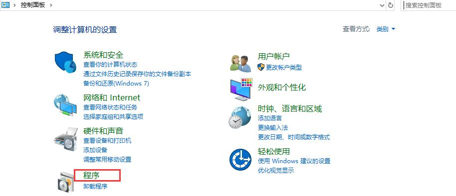
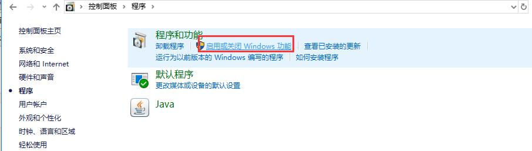
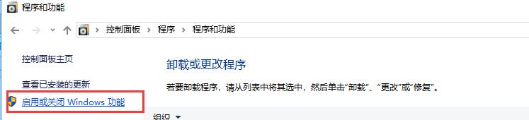
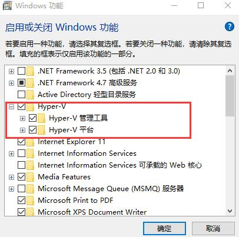

# 3.1：Hyper-V 入门知识

为什么这里要介绍Hyper-V? 平时我们系统使用windows 操作系统来浏览网页，而且windows 10 目前也是趋势，既然windows 10 系统自带虚拟化组件，我们何必还要去装第三方组件来降低系统性能呢？

**Hyper-V 的优势：**

安装简单、已操作及随机启动、保持原有虚拟机状态，每次重启系统无需手动去干预启动虚拟机

**Hyper-V 的安装：**

