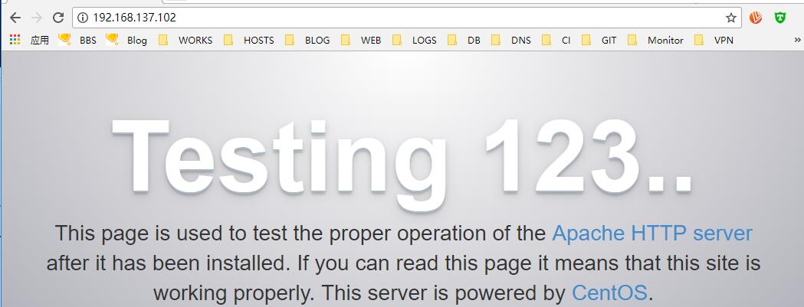

# 16.1：yum 安装LAMP

在命令行下执行下面的命令快速安装 LAMP 环境：

```bash
[root@centos ~]# yum install -y mariadb mariadb-libs mariadb-devel mariadb-server php php-devel php-mysqlnd php-pdo php-mysql php-common php-bcmath php-xml php-soap php-snmp httpd httpd-tools pcre pcre-devel httpd-devel
```

安装完成后，在 /etc/ 目录下会生成 php 和 httpd 的配置文件生成目录：

```bash
[root@centos ~]# ls /etc/httpd/
conf  conf.d  conf.modules.d  logs  modules  run
```

```bash
[root@centos ~]# ls /etc/php.d/
bcmath.ini  dom.ini       json.ini     mysqlnd_mysqli.ini  pdo.ini          pdo_sqlite.ini  snmp.ini  sqlite3.ini  xmlreader.ini  xsl.ini
curl.ini    fileinfo.ini  mysqlnd.ini  mysqlnd_mysql.ini   pdo_mysqlnd.ini  phar.ini        soap.ini  wddx.ini     xmlwriter.ini  zip.ini

[root@centos ~]# ls /etc/php.ini
/etc/php.ini
```

http 结合 php 的配置文件：

```bash
[root@centos ~]# cat /etc/httpd/conf.modules.d/10-php.conf
#
# PHP is an HTML-embedded scripting language which attempts to make it
# easy for developers to write dynamically generated webpages.
#
<IfModule prefork.c>
  LoadModule php5_module modules/libphp5.so
</IfModule>

```

启动httpd:

```bash
[root@centos ~]# systemctl start httpd
```

查看其 的进程和端口：

```bash
[root@centos ~]# ps aux|egrep httpd
root       1543  1.5  1.6 358832 15208 ?        Ss   02:35   0:00 /usr/sbin/httpd -DFOREGROUND
apache     1544  0.0  0.8 358832  8200 ?        S    02:35   0:00 /usr/sbin/httpd -DFOREGROUND
apache     1545  0.0  0.8 358832  8200 ?        S    02:35   0:00 /usr/sbin/httpd -DFOREGROUND
apache     1546  0.0  0.8 358832  8200 ?        S    02:35   0:00 /usr/sbin/httpd -DFOREGROUND
apache     1547  0.0  0.8 358832  8200 ?        S    02:35   0:00 /usr/sbin/httpd -DFOREGROUND
apache     1548  0.0  0.8 358832  8200 ?        S    02:35   0:00 /usr/sbin/httpd -DFOREGROUND
root       1556  0.0  0.1 112660   972 pts/0    R+   02:35   0:00 grep -E --color=auto httpd
```

```bash
[root@centos ~]# ss -lntp|egrep httpd
LISTEN     0      128         :::80                      :::*                   users:(("httpd",pid=1548,fd=4),("httpd",pid=1547,fd=4),("httpd",pid=1546,fd=4),("httpd",pid=1545,fd=4),("httpd",pid=1544,fd=4),("httpd",pid=1543,fd=4))
```

配置防护墙访问80端口的策略：

```bash
[root@centos ~]# firewall-cmd --add-service=http
success
```

测试访问：




