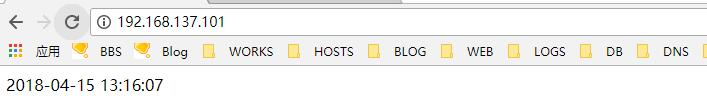

# 16.3：配置虚拟主机

1、编辑apache 主配置文件 /usr/local/apache2/conf/httpd.conf，找到这一行： \#Include conf/extra/httpd-vhosts.conf ，将前面的注释井号去掉，表启用虚拟主机配置：

```bash
Include conf/extra/httpd-vhosts.conf
```

2、编辑虚拟主机文件 /usr/local/apache2/conf/extra/httpd-vhosts.conf，将其默认的配置文件都注释掉，重新写配置，如下：

```bash
# Virtual Hosts
#
# Required modules: mod_log_config

# If you want to maintain multiple domains/hostnames on your
# machine you can setup VirtualHost containers for them. Most configurations
# use only name-based virtual hosts so the server doesn't need to worry about
# IP addresses. This is indicated by the asterisks in the directives below.
#
# Please see the documentation at
# <URL:http://httpd.apache.org/docs/2.4/vhosts/>
# for further details before you try to setup virtual hosts.
#
# You may use the command line option '-S' to verify your virtual host
# configuration.

#
# VirtualHost example:
# Almost any Apache directive may go into a VirtualHost container.
# The first VirtualHost section is used for all requests that do not
# match a ServerName or ServerAlias in any <VirtualHost> block.
#
#<VirtualHost *:80>
#    ServerAdmin webmaster@dummy-host.example.com
#    DocumentRoot "/usr/local/apache2/docs/dummy-host.example.com"
#    ServerName dummy-host.example.com
#    ServerAlias www.dummy-host.example.com
#    ErrorLog "logs/dummy-host.example.com-error_log"
#    CustomLog "logs/dummy-host.example.com-access_log" common
#</VirtualHost>
#
#<VirtualHost *:80>
#    ServerAdmin webmaster@dummy-host2.example.com
#    DocumentRoot "/usr/local/apache2/docs/dummy-host2.example.com"
#    ServerName dummy-host2.example.com
#    ErrorLog "logs/dummy-host2.example.com-error_log"
#    CustomLog "logs/dummy-host2.example.com-access_log" common
#</VirtualHost>


<VirtualHost 192.168.137.101:80>
    ServerName test.apache.com
    DocumentRoot "/data/apache/website/test"
    CustomLog "logs/access.log" common
    ErrorLog "logs/error.log"
    <Directory "/data/apache/website/test">
        Options -Indexes
        AllowOverride ALL
        Require all granted
    </Directory>
</VirtualHost>
```

3、新建web 项目存放目录 /data/apache/website/test：

```bash
[root@centos ~]# mkdir -p /data/apache/website/test
```

4、在web 项目目录下创建测试文件 index.php，内容如下：

```php
<?php

    echo $showtime=date("Y-m-d H:i:s");

?>
```

将其所属主合组都修改为 apache：

```bash
 [root@centos ~]# chown -R apache.apache /data/apache/
```

5、检查配置文件是否有误：

```bash
[root@centos ~]# /usr/local/apache2/bin/apachectl -t
Syntax OK
```

 6、因为上面测试的脚本是输出系统当前时间，跟 php 有关，所以我们还要编辑 /usr/local/php/etc/php.ini 文件, 启用： ;date.timezone =:

```bash
 date.timezone = Asia/Shanghai
```

7、重载apache:

```bash
[root@centos ~]# systemctl reload httpd
```

8、测试访问（注：只能用 192.168.137.101这个IP或者本地hosts 做解析，使用域名  test.apache.com 访问）：




