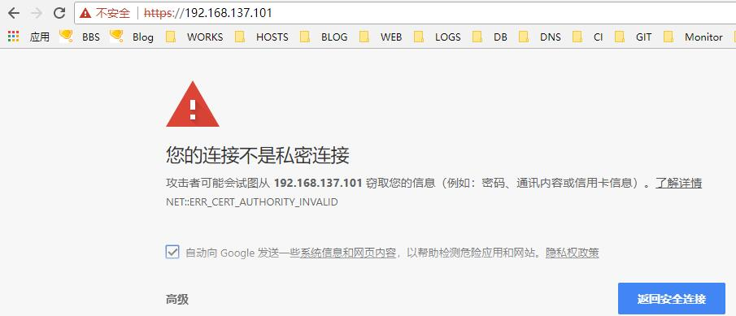
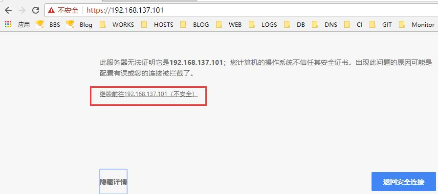
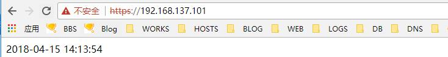

# 16.4：配置SSL ，俗称HTTPS

先声明：因为这里我是演示，使用自签证书来配置，所以浏览网站时会提示证书不受信任或者不安全之类的。等后期大家在工作中使用的都是从授信机构购买的证书，就不会出现这种问题了。

1、在 /usr/local/ 目录下创建 ssl 目录，同时在该目录下创建web 项目对应的域名目录，比如我上面的域名是 test.apache.com ，则应创建目录： /usr/local/ssl/test.apache.com:

```bash
[root@centos ~]# mkdir -p /usr/local/ssl/test.apache.com
```

2、进入该目录：

```bash
[root@centos ~]# cd /usr/local/ssl/test.apache.com
```

3、使用openssl 生成 2048 位私钥：

```text
[root@centos test.apache.com]# openssl genrsa -out server.key 2048
Generating RSA private key, 2048 bit long modulus
......................................+++
..................+++
e is 65537 (0x10001)
```

4、 然后，生成证书签名请求（CSR），这里需要填写许多信息，如国家，省市，公司等

```text
[root@centos test.apache.com]# openssl req -new -key server.key -out server.csr
You are about to be asked to enter information that will be incorporated
into your certificate request.
What you are about to enter is what is called a Distinguished Name or a DN.
There are quite a few fields but you can leave some blank
For some fields there will be a default value,
If you enter '.', the field will be left blank.
-----
Country Name (2 letter code) [XX]:CN
State or Province Name (full name) []:FJ
Locality Name (eg, city) [Default City]:XM
Organization Name (eg, company) [Default Company Ltd]:xinbo
Organizational Unit Name (eg, section) []:IT
Common Name (eg, your name or your server's hostname) []:test.apache.com #注：这里要写域名
Email Address []:

Please enter the following 'extra' attributes
to be sent with your certificate request
A challenge password []:
An optional company name []:
```

5、 生成类型为X509的自签名证书。有效期设置3650天，即有效期为10年

```bash
[root@centos test.apache.com]# openssl x509 -req -days 3650 -in server.csr -signkey server.key -out server.crt
Signature ok
subject=/C=CN/ST=FJ/L=XM/O=xinbo/OU=IT/CN=test.apache.com
Getting Private key
```

6、编辑 apache 主配置文件，在 Listen 80 下面加一行：

```bash
Listen 443
```

同时，需要启用该配置文件中的 rewrite 模块 和 ssl 模块;

```bash
LoadModule rewrite_module modules/mod_rewrite.so
LoadModule ssl_module modules/mod_ssl.so
```

7、编辑虚拟主机配置文件 /usr/local/apache2/conf/extra/httpd-vhosts.conf，配置如下：

```bash
<VirtualHost 192.168.137.101:80>
    ServerName test.apache.com
    DocumentRoot "/data/apache/website/test"
    CustomLog "logs/access.log" common
    ErrorLog "logs/error.log"
    <Directory "/data/apache/website/test">
        Options Indexes
        AllowOverride ALL
        Require all granted
    </Directory>

    RewriteEngine on
    RewriteCond %{SERVER_PORT} !^443$
    RewriteRule ^(.*)?$ https://%{SERVER_NAME}$1 [L,R]
</VirtualHost>

<VirtualHost 192.168.137.101:443>
    SSLEngine on
    SSLCertificateFile /usr/local/ssl/test.apache.com/server.crt
    SSLCertificateKeyFile /usr/local/ssl/test.apache.com/server.key
    directoryIndex index.htm index.html index.php
    DocumentRoot "/data/apache/website/test"
    <Directory "/data/apache/website/test">
        Options Indexes
        AllowOverride ALL
        Require all granted
    </Directory>
</VirtualHost>
```

8、检测配置是否有误：

```bash
[root@centos test.apache.com]# /usr/local/apache2/bin/apachectl -t
httpd: Syntax error on line 135 of /usr/local/apache2/conf/httpd.conf: Cannot load modules/mod_ssl.so into server: libssl.so.1.1: cannot open shared object file: No such file or directory
```

报错，解决方法：

```text
[root@centos test.apache.com]# find / -name 'libssl.so.1.1'
/usr/local/src/openssl-1.1.0h/libssl.so.1.1
/usr/local/openssl/lib/libssl.so.1.1
```

```text
[root@centos test.apache.com]# ln -s /usr/local/openssl/lib/libssl.so.1.1 /usr/lib64/
```

再次检测：

```bash
[root@centos test.apache.com]# /usr/local/apache2/bin/apachectl -t
httpd: Syntax error on line 135 of /usr/local/apache2/conf/httpd.conf: Cannot load modules/mod_ssl.so into server: libcrypto.so.1.1: cannot open shared object file: No such file or directory
```

报错，解决方法：

```bash
[root@centos test.apache.com]# find / -name 'libcrypto.so.1.1'
/usr/local/src/openssl-1.1.0h/libcrypto.so.1.1
/usr/local/openssl/lib/libcrypto.so.1.1
```

```bash
[root@centos test.apache.com]# ln -s /usr/local/openssl/lib/libcrypto.so.1.1 /usr/lib64/
```

再次检测：

```bash
[root@centos test.apache.com]# /usr/local/apache2/bin/apachectl -t
Syntax OK
```

9、没问题了，重新reload 下 httpd:

```bash
[root@centos test.apache.com]# systemctl reload httpd
```

查看监听的端口，是否有多 443;

```bash
[root@centos test.apache.com]# ss -lntp|egrep httpd
LISTEN     0      128         :::80                      :::*                   users:(("httpd",pid=60204,fd=4),("httpd",pid=60203,fd=4),("httpd",pid=60202,fd=4),("httpd",pid=59819,fd=4))
LISTEN     0      128         :::443                     :::*                   users:(("httpd",pid=60204,fd=6),("httpd",pid=60203,fd=6),("httpd",pid=60202,fd=6),("httpd",pid=59819,fd=6))
```

10、开启防火墙的443 端口：

```bash
[root@centos test.apache.com]# firewall-cmd --add-service=https
success
```

11、测试访问：







