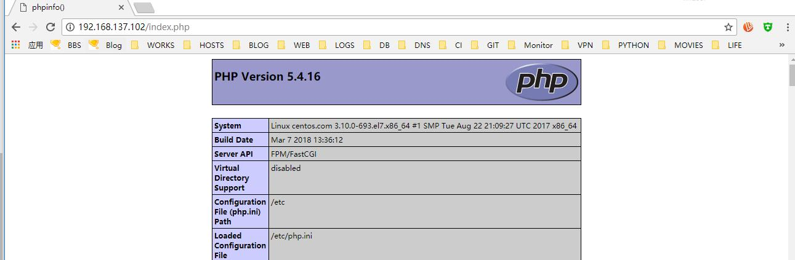

# 17.1：yum 安装 lnmp 环境

centos 默认是没有nginx 的源的，如果要想使用yum 来安装lnmp ，那么就必须先安装好扩展源 epel-release:

```bash
[root@centos ~]# yum install -y epel-release
```

1、使用如下命令安装lnmp 环境：

```bash
[root@centos ~]# yum install -y mariadb mariadb-libs mariadb-server mariadb-devel nginx php php-devel php-fpm php-gd php-xmlphp-mbstring php-mcrypt php-mysqlnd php-pdo php-php-gettext php-soap
```

2、安装完成后，查看下nginx 和 php 的目录结构：

```bash
[root@centos ~]# ls /etc/nginx/
conf.d     fastcgi.conf          fastcgi_params          koi-utf  mime.types          nginx.conf          scgi_params          uwsgi_params          win-utf
default.d  fastcgi.conf.default  fastcgi_params.default  koi-win  mime.types.default  nginx.conf.default  scgi_params.default  uwsgi_params.default
```

```bash
[root@centos ~]# ls /etc/php
php.d/        php-fpm.conf  php-fpm.d/    php.ini
```

查看nginx 和 php-fpm 的启动脚本;

```bash
[root@centos ~]# cat /usr/lib/systemd/system/nginx.service
[Unit]
Description=The nginx HTTP and reverse proxy server
After=network.target remote-fs.target nss-lookup.target

[Service]
Type=forking
PIDFile=/run/nginx.pid
# Nginx will fail to start if /run/nginx.pid already exists but has the wrong
# SELinux context. This might happen when running `nginx -t` from the cmdline.
# https://bugzilla.redhat.com/show_bug.cgi?id=1268621
ExecStartPre=/usr/bin/rm -f /run/nginx.pid
ExecStartPre=/usr/sbin/nginx -t
ExecStart=/usr/sbin/nginx
ExecReload=/bin/kill -s HUP $MAINPID
KillSignal=SIGQUIT
TimeoutStopSec=5
KillMode=process
PrivateTmp=true

[Install]
WantedBy=multi-user.target
```

```bash
[root@centos ~]# cat /usr/lib/systemd/system/php-fpm.service
[Unit]
Description=The PHP FastCGI Process Manager
After=syslog.target network.target

[Service]
Type=notify
PIDFile=/run/php-fpm/php-fpm.pid
EnvironmentFile=/etc/sysconfig/php-fpm
ExecStart=/usr/sbin/php-fpm --nodaemonize
ExecReload=/bin/kill -USR2 $MAINPID
PrivateTmp=true

[Install]
WantedBy=multi-user.target
```

3、启动nginx：

```bash
[root@centos ~]# systemctl start nginx
```

查看监听的进程：

```bash
[root@centos ~]# ps aux|egrep nginx
root       1876  0.0  0.2 122908  2112 ?        Ss   03:05   0:00 nginx: master process /usr/sbin/nginx
nginx      1877  0.0  0.3 123296  3588 ?        S    03:05   0:00 nginx: worker process
root       1889  0.0  0.1 112660   972 pts/0    R+   03:11   0:00 grep -E --color=auto nginx
```

4、开放防火墙的80 端口：

```bash
[root@centos ~]# firewall-cmd --add-service=http
success
```

测试访问：


5、编辑nginx 主配置文件，在 server 段 加上结合php 解析的配置，如下：

```bash
        location ~ \.php$ {
            root           /usr/share/nginx/html;
            fastcgi_pass   127.0.0.1:9000;
            fastcgi_index  index.php;
            fastcgi_param  SCRIPT_FILENAME  $document_root$fastcgi_script_name;
            include        fastcgi_params;
        }
```

完整配置：

```bash
[root@centos nginx]# cat nginx.conf
# For more information on configuration, see:
#   * Official English Documentation: http://nginx.org/en/docs/
#   * Official Russian Documentation: http://nginx.org/ru/docs/

user nginx;
worker_processes auto;
error_log /var/log/nginx/error.log;
pid /run/nginx.pid;

# Load dynamic modules. See /usr/share/nginx/README.dynamic.
include /usr/share/nginx/modules/*.conf;

events {
    worker_connections 1024;
}

http {
    log_format  main  '$remote_addr - $remote_user [$time_local] "$request" '
                      '$status $body_bytes_sent "$http_referer" '
                      '"$http_user_agent" "$http_x_forwarded_for"';

    access_log  /var/log/nginx/access.log  main;

    sendfile            on;
    tcp_nopush          on;
    tcp_nodelay         on;
    keepalive_timeout   65;
    types_hash_max_size 2048;

    include             /etc/nginx/mime.types;
    default_type        application/octet-stream;

    # Load modular configuration files from the /etc/nginx/conf.d directory.
    # See http://nginx.org/en/docs/ngx_core_module.html#include
    # for more information.
    include /etc/nginx/conf.d/*.conf;

    server {
        listen       80 default_server;
        listen       [::]:80 default_server;
        server_name  _;
        root         /usr/share/nginx/html;

        # Load configuration files for the default server block.
        include /etc/nginx/default.d/*.conf;

        location / {
        }

        location ~ \.php$ {
            root           /usr/share/nginx/html;
            fastcgi_pass   127.0.0.1:9000;
            fastcgi_index  index.php;
            fastcgi_param  SCRIPT_FILENAME  $document_root$fastcgi_script_name;
            include        fastcgi_params;
        }

        error_page 404 /404.html;
            location = /40x.html {
        }

        error_page 500 502 503 504 /50x.html;
            location = /50x.html {
        }
    }

# Settings for a TLS enabled server.
#
#    server {
#        listen       443 ssl http2 default_server;
#        listen       [::]:443 ssl http2 default_server;
#        server_name  _;
#        root         /usr/share/nginx/html;
#
#        ssl_certificate "/etc/pki/nginx/server.crt";
#        ssl_certificate_key "/etc/pki/nginx/private/server.key";
#        ssl_session_cache shared:SSL:1m;
#        ssl_session_timeout  10m;
#        ssl_ciphers HIGH:!aNULL:!MD5;
#        ssl_prefer_server_ciphers on;
#
#        # Load configuration files for the default server block.
#        include /etc/nginx/default.d/*.conf;
#
#        location / {
#        }
#
#        error_page 404 /404.html;
#            location = /40x.html {
#        }
#
#        error_page 500 502 503 504 /50x.html;
#            location = /50x.html {
#        }
#    }

}
```

6、在/usr/share/nginx/html/ 目录下新建 index.php 文件，内容如下：

```text
<?php

    echo phpinfo();
?>
```

7、检测nginx 配置：

```text
[root@centos nginx]# nginx -t
nginx: the configuration file /etc/nginx/nginx.conf syntax is ok
nginx: configuration file /etc/nginx/nginx.conf test is successful
```

8、重载nginx:

```bash
[root@centos nginx]# nginx -s reload
```

9、测试访问php:



