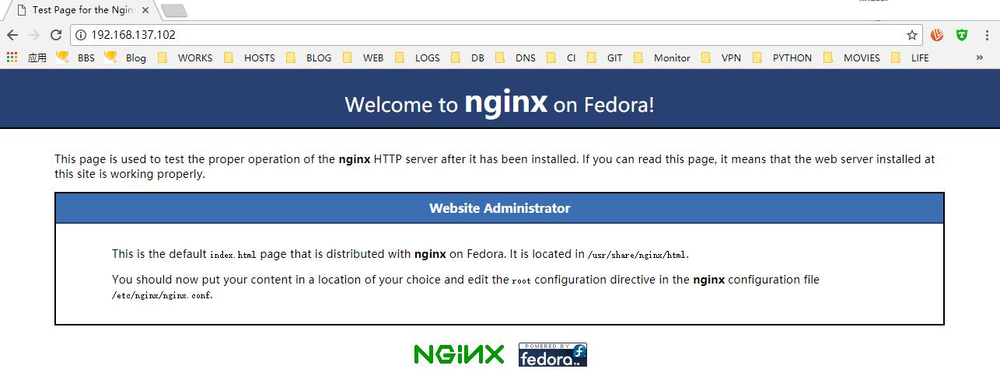
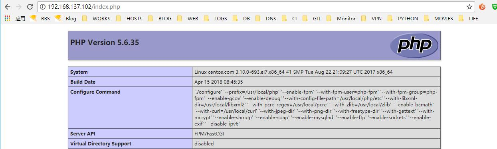

# 17.2：源码编译LNMP

首先，在开始在前，确保系统有安装centos 扩展源 epel-release:

1、先下载以下源码包到 /usr/local/src 目录下

```bash
[root@centos ~]# wget -O /usr/local/src/nginx-1.13.12.tar.gz http://nginx.org/download/nginx-1.13.12.tar.gz
--2018-04-15 07:51:23--  http://nginx.org/download/nginx-1.13.12.tar.gz
Resolving nginx.org (nginx.org)... 206.251.255.63, 95.211.80.227, 2606:7100:1:69::3f, ...
Connecting to nginx.org (nginx.org)|206.251.255.63|:80... connected.
HTTP request sent, awaiting response... 200 OK
Length: 1016311 (992K) [application/octet-stream]
Saving to: ‘/usr/local/src/nginx-1.13.12.tar.gz’

100%[==========================================================================================>] 1,016,311    541KB/s   in 1.8s

2018-04-15 07:51:25 (541 KB/s) - ‘/usr/local/src/nginx-1.13.12.tar.gz’ saved [1016311/1016311]

[root@centos ~]# wget -O /usr/local/src/openssl-1.1.0h.tar.gz https://www.openssl.org/source/openssl-1.1.0h.tar.gz
--2018-04-15 07:52:20--  https://www.openssl.org/source/openssl-1.1.0h.tar.gz
Resolving www.openssl.org (www.openssl.org)... 184.87.135.30, 2600:1417:4000:184::c1e, 2600:1417:4000:180::c1e
Connecting to www.openssl.org (www.openssl.org)|184.87.135.30|:443... connected.
HTTP request sent, awaiting response... 200 OK
Length: 5422717 (5.2M) [application/x-gzip]
Saving to: ‘/usr/local/src/openssl-1.1.0h.tar.gz’

100%[==========================================================================================>] 5,422,717    688KB/s   in 7.9s

2018-04-15 07:52:28 (670 KB/s) - ‘/usr/local/src/openssl-1.1.0h.tar.gz’ saved [5422717/5422717]

[root@centos ~]# wget -O /usr/local/src/pcre-8.40.tar.gz https://ftp.pcre.org/pub/pcre/pcre-8.40.tar.gz
--2018-04-15 07:52:51--  https://ftp.pcre.org/pub/pcre/pcre-8.40.tar.gz
Resolving ftp.pcre.org (ftp.pcre.org)... 131.111.8.88
Connecting to ftp.pcre.org (ftp.pcre.org)|131.111.8.88|:443... connected.
HTTP request sent, awaiting response... 200 OK
Length: 2065161 (2.0M) [application/x-gunzip]
Saving to: ‘/usr/local/src/pcre-8.40.tar.gz’

100%[==========================================================================================>] 2,065,161    637KB/s   in 3.2s

2018-04-15 07:52:56 (637 KB/s) - ‘/usr/local/src/pcre-8.40.tar.gz’ saved [2065161/2065161]

[root@centos ~]# wget -O /usr/local/src/php-5.6.35.tar.gz http://hk2.php.net/distributions/php-5.6.35.tar.gz
--2018-04-15 07:55:24--  http://hk2.php.net/distributions/php-5.6.35.tar.gz
Resolving hk2.php.net (hk2.php.net)... 180.92.182.149
Connecting to hk2.php.net (hk2.php.net)|180.92.182.149|:80... connected.
HTTP request sent, awaiting response... 200 OK
Length: 19296925 (18M) [application/x-gzip]
Saving to: ‘/usr/local/src/php-5.6.35.tar.gz’

100%[=========================================================================================>] 19,296,925   691KB/s   in 29s

2018-04-15 07:55:54 (642 KB/s) - ‘/usr/local/src/php-5.6.35.tar.gz’ saved [19296925/19296925]


[root@centos ~]# wget -O /usr/local/src/zlib-1.2.11.tar.gz  http://zlib.net/zlib-1.2.11.tar.gz
--2018-04-15 08:10:28--  http://zlib.net/zlib-1.2.11.tar.gz
Resolving zlib.net (zlib.net)... 68.66.224.164
Connecting to zlib.net (zlib.net)|68.66.224.164|:80... connected.
HTTP request sent, awaiting response... 200 OK
Length: 607698 (593K) [application/x-gzip]
Saving to: ‘/usr/local/src/zlib-1.2.11.tar.gz’

100%[=========================================================================================>] 607,698      768KB/s   in 0.8s

2018-04-15 08:10:30 (768 KB/s) - ‘/usr/local/src/zlib-1.2.11.tar.gz’ saved [607698/607698]


[root@centos ~]# wget -O /usr/local/src/libxml2-2.9.1.tar.gz ftp://xmlsoft.org/libxml2/libxml2-2.9.1.tar.gz
--2018-04-15 08:28:06--  ftp://xmlsoft.org/libxml2/libxml2-2.9.1.tar.gz
           => ‘/usr/local/src/libxml2-2.9.1.tar.gz’
Resolving xmlsoft.org (xmlsoft.org)... 91.121.203.120
Connecting to xmlsoft.org (xmlsoft.org)|91.121.203.120|:21... connected.
Logging in as anonymous ... Logged in!
==> SYST ... done.    ==> PWD ... done.
==> TYPE I ... done.  ==> CWD (1) /libxml2 ... done.
==> SIZE libxml2-2.9.1.tar.gz ... 5172503
==> PASV ... done.    ==> RETR libxml2-2.9.1.tar.gz ... done.
Length: 5172503 (4.9M) (unauthoritative)

100%[==========================================================================================>] 5,172,503    485KB/s   in 11s

2018-04-15 08:28:23 (442 KB/s) - ‘/usr/local/src/libxml2-2.9.1.tar.gz’ saved [5172503]


[root@centos ~]# wget -O /usr/local/src/curl-7.59.0.tar.gz https://curl.haxx.se/download/curl-7.59.0.tar.gz
--2018-04-15 08:28:51--  https://curl.haxx.se/download/curl-7.59.0.tar.gz
Resolving curl.haxx.se (curl.haxx.se)... 151.101.2.49, 151.101.66.49, 151.101.130.49, ...
Connecting to curl.haxx.se (curl.haxx.se)|151.101.2.49|:443... connected.
HTTP request sent, awaiting response... 200 OK
Length: 3907587 (3.7M) [application/x-gzip]
Saving to: ‘/usr/local/src/curl-7.59.0.tar.gz’

100%[==========================================================================================>] 3,907,587    607KB/s   in 6.2s

2018-04-15 08:28:57 (615 KB/s) - ‘/usr/local/src/curl-7.59.0.tar.gz’ saved [3907587/3907587]
```

2、解压下载的源码文件到下载目录：

```bash
[root@centos ~]# tar -zxf /usr/local/src/nginx-1.13.12.tar.gz -C /usr/local/src/
[root@centos ~]# tar -zxf /usr/local/src/php-5.6.35.tar.gz -C /usr/local/src/
[root@centos ~]# tar -zxf /usr/local/src/pcre-8.40.tar.gz -C /usr/local/src/
[root@centos ~]# tar -zxf /usr/local/src/openssl-1.1.0h.tar.gz -C /usr/local/src/
[root@centos ~]# tar -zxf /usr/local/src/zlib-1.2.11.tar.gz -C /usr/local/src/
[root@centos ~]# tar -zxf /usr/local/src/curl-7.59.0.tar.gz -C /usr/local/src/
[root@centos ~]# tar -zxf /usr/local/src/libxml2-2.9.1.tar.gz -C /usr/local/src/
```

3、进入解压的 openssl 目录，编译安装 openssl

```bash
[root@centos ~]# cd /usr/local/src/openssl-1.1.0h
[root@centos openssl-1.1.0h]# ./config --prefix=/usr/local/openssl
[root@centos openssl-1.1.0h]# make
[root@centos openssl-1.1.0h]# make install
```

4、进入解压的pcre 目录，编译安装pcre

```bash
[root@centos openssl-1.1.0h]# cd ../pcre-8.40
[root@centos pcre-8.40]# ./configure --prefix=/usr/local/pcre
[root@centos pcre-8.40]# make
[root@centos pcre-8.40]# make install
```

5、进入解压的zlib 目录，编译安装zlib:

```bash
[root@centos pcre-8.40]# cd ../zlib-1.2.11
[root@centos zlib-1.2.11]# ./configure --prefix=/usr/local/zlib
[root@centos zlib-1.2.11]# make
[root@centos zlib-1.2.11]# make install
```

6、进入解压的 curl 目录，编译安装 crul:

```bash
[root@centos zlib-1.2.11]# cd ../curl-7.59.0
[root@centos curl-7.59.0]# ./configure --prefix=/usr/local/curl
[root@centos curl-7.59.0]# make 
[root@centos curl-7.59.0]# make install
```

7、进入解压的 libxml2 目录，编译安装libxml2:

```bash
[root@centos curl-7.59.0]# cd ../libxml2-2.9.1
[root@centos libxml2-2.9.1]# ./configure --prefix=/usr/local/libxml2
[root@centos libxml2-2.9.1]# make
```

编译报错;

```bash
make[4]: Entering directory `/usr/local/src/libxml2-2.9.1/python'
  CC     libxml.lo
libxml.c:14:20: fatal error: Python.h: No such file or directory
 #include <Python.h>
                    ^
compilation terminated.
make[4]: *** [libxml.lo] Error 1
make[4]: Leaving directory `/usr/local/src/libxml2-2.9.1/python'
make[3]: *** [all-recursive] Error 1
make[3]: Leaving directory `/usr/local/src/libxml2-2.9.1/python'
make[2]: *** [all] Error 2
make[2]: Leaving directory `/usr/local/src/libxml2-2.9.1/python'
make[1]: *** [all-recursive] Error 1
make[1]: Leaving directory `/usr/local/src/libxml2-2.9.1'
make: *** [all] Error 2
`
```

解决方法：使用yum 安装 python-devel

```bash
[root@centos libxml2-2.9.1]# yum install -y python-devel
```

重新编译安装：

```bash
[root@centos libxml2-2.9.1]# make
[root@centos libxml2-2.9.1]# make install
```

8、进入解压的nginx 目录，编译安装nginx；

```bash
[root@centos libxml2-2.9.1]# cd ../nginx-1.13.12
[root@centos nginx-1.13.12]# mkdir -p /usr/local/nginx/tmp/{body,proxy,fastcgi}
[root@centos nginx-1.13.12]# useradd -s /sbin/nologin nginx
[root@centos nginx-1.13.12]# ./configure --prefix=/usr/local/nginx --user=nginx --group=nginx --with-poll_module --with-http_ssl_module --with-http_realip_module --with-http_image_filter_module=dynamic --with-http_flv_module --with-http_mp4_module --with-http_gunzip_module --with-http_gzip_static_module --with-http_auth_request_module --with-http_random_index_module --with-http_secure_link_module --with-http_stub_status_module --http-log-path=/usr/local/logs/access.log --http-client-body-temp-path=/usr/local/nginx/tmp/body --http-proxy-temp-path=/usr/local/nginx/tmp/proxy --http-fastcgi-temp-path=/usr/local/nginx/tmp/fastcgi --with-stream=dynamic --with-pcre=/usr/local/src/pcre-8.40 --with-zlib=/usr/local/src/zlib-1.2.11 --with-openssl=/usr/local/src/openssl-1.1.0h --with-debug
```

配置检查编译参数报错：

```bash
checking for GD library ... not found
checking for GD library in /usr/local/ ... not found
checking for GD library in /usr/pkg/ ... not found
checking for GD library in /opt/local/ ... not found

./configure: error: the HTTP image filter module requires the GD library.
You can either do not enable the module or install the libraries.
```

解决方法：使用yum 安装 gd-devel:

```bash
[root@centos nginx-1.13.12]# yum install -y gd-devel
```

重新配置编译参数进行编译安装：

```bash
[root@centos nginx-1.13.12]# ./configure --prefix=/usr/local/nginx --user=nginx --group=nginx --with-poll_module --with-http_ssl_module --with-http_realip_module --with-http_image_filter_module=dynamic --with-http_flv_module --with-http_mp4_module --with-http_gunzip_module --with-http_gzip_static_module --with-http_auth_request_module --with-http_random_index_module --with-http_secure_link_module --with-http_stub_status_module --http-log-path=/usr/local/logs/access.log --http-client-body-temp-path=/usr/local/nginx/tmp/body --http-proxy-temp-path=/usr/local/nginx/tmp/proxy --http-fastcgi-temp-path=/usr/local/nginx/tmp/fastcgi --with-stream=dynamic --with-pcre=/usr/local/src/pcre-8.40 --with-zlib=/usr/local/src/zlib-1.2.11 --with-openssl=/usr/local/src/openssl-1.1.0h --with-debug
[root@centos nginx-1.13.12]# make
[root@centos nginx-1.13.12]# make install
```

创建 nginx 临时文件目录，同时添加系统用户nginx ，禁止其登录系统;

```bash
[root@centos nginx-1.13.12]# mkdir -p /usr/local/nginx/tmp/{body,proxy,fastcgi}
[root@centos nginx-1.13.12]# useradd -s /sbin/nologin nginx
```

在 /usr/lib/systemd/systemd/system 目录下创建nginx 启动脚本文件 nginx.service ，内容如下：

```bash
[Unit]
Description=Nginx
After=syslog.target network.target

[Service]
Type=forking
ExecStart=/usr/local/nginx/sbin/nginx
ExecReload=/usr/local/nginx/sbin/nginx -s reload
ExecStop=/usr/local/nginx/sbin/nginx -s quit

[Install]
WantedBy=multi-user.target
```

9、进入php 解压目录，编译安装PHP：

```bash
[root@centos nginx-1.13.12]# cd ../php-5.6.35
[root@centos php-5.6.35]# useradd -s /sbin/nologin php-fpm
[root@centos php-5.6.35]# ./configure --prefix=/usr/local/php --enable-fpm --with-fpm-user=php-fpm --with-fpm-group=php-fpm --enable-gcov --enable-debug --with-config-file-path=/usr/local/php/etc --with-libxml-dir=/usr/local/libxml2 --with-openssl=/usr/local/openssl/ --with-pcre-regex=/usr/local/pcre --with-zlib=/usr/local/zlib --enable-bcmath --with-curl=/usr/local/curl --with-jpeg-dir --with-png-dir --with-freetype-dir --with-gettext --with-mcrypt --enable-shmop --enable-soap  --enable-mysqlnd --enable-ftp -enable-sockets --enable-exif --disable-ipv6  --enable-mbstring --with-gd --with-mysqli
```

配置检查编译参数报错：

```bash
General settings
checking whether to include gcov symbols... yes
checking for lcov... no
checking for genhtml... no
configure: error: To enable code coverage reporting you must have LTP installed
`
```

解决方法：使用yum 安装 lcov

```bash
[root@centos php-5.6.35]# yum install -y lcov
```

重新配置检查编译参数报错：

```bash
[root@centos php-5.6.35]# ./configure --prefix=/usr/local/php --enable-fpm --with-fpm-user=php-fpm --with-fpm-group=php-fpm --enable-gcov --enable-debug --with-config-file-path=/usr/local/php/etc --with-libxml-dir=/usr/local/libxml2 --with-openssl=/usr/local/openssl/ --with-pcre-regex=/usr/local/pcre --with-zlib=/usr/local/zlib --enable-bcmath --with-curl=/usr/local/curl --with-jpeg-dir --with-png-dir --with-freetype-dir --with-gettext --with-mcrypt --enable-shmop --enable-soap  --enable-mysqlnd --enable-ftp -enable-sockets --enable-exif --disable-ipv6 --enable-mbstring --with-gd --with-mysqli
```

配置检查编译参数报错：

```bash
checking for external libmbfl... no
checking for external oniguruma... no
checking for mcrypt support... yes
configure: error: mcrypt.h not found. Please reinstall libmcrypt.
```

解决方法：使用yum libmcrypt-devel

```bash
[root@centos php-5.6.35]# yum install -y libmcrypt-devel
```

再次配置检查编译参数并编译：

```bash
[root@centos php-5.6.35]# ./configure --prefix=/usr/local/php --enable-fpm --with-fpm-user=php-fpm --with-fpm-group=php-fpm --enable-gcov --enable-debug --with-config-file-path=/usr/local/php/etc --with-libxml-dir=/usr/local/libxml2 --with-openssl=/usr/local/openssl/ --with-pcre-regex=/usr/local/pcre --with-zlib=/usr/local/zlib --enable-bcmath --with-curl=/usr/local/curl --with-jpeg-dir --with-png-dir --with-freetype-dir --with-gettext --with-mcrypt --enable-shmop --enable-soap  --enable-mysqlnd --enable-ftp -enable-sockets --enable-exif --disable-ipv6 --enable-mbstring --with-gd --with-mysqli
[root@centos php-5.6.35]# make
```

编译报错：

```bash
/usr/local/src/php-5.6.35/ext/openssl/openssl.c: In function ‘openssl_x509v3_subjectAltName’:
/usr/local/src/php-5.6.35/ext/openssl/openssl.c:1904:15: error: dereferencing pointer to incomplete type
  p = extension->value->data;
               ^
/usr/local/src/php-5.6.35/ext/openssl/openssl.c:1905:20: error: dereferencing pointer to incomplete type
  length = extension->value->length;
                    ^
```

解决方法：去掉编译参数中的 --with-openssl=/usr/local/openssl ，重新配置检查编译参数：

```bash
[root@centos php-5.6.35]# ./configure --prefix=/usr/local/php --enable-fpm --with-fpm-user=php-fpm --with-fpm-group=php-fpm --enable-gcov --enable-debug --with-config-file-path=/usr/local/php/etc --with-libxml-dir=/usr/local/libxml2 --with-pcre-regex=/usr/local/pcre --with-zlib=/usr/local/zlib --enable-bcmath --with-curl=/usr/local/curl --with-jpeg-dir --with-png-dir --with-freetype-dir --with-gettext --with-mcrypt --enable-shmop --enable-soap  --enable-mysqlnd --enable-ftp -enable-sockets --enable-exif --disable-ipv6 --enable-mbstring --with-gd --with-mysqli
```

重新编译及安装：

```bash
[root@centos php-5.6.35]# make
[root@centos php-5.6.35]# make install
```

安装完成后，复制php 主配置文件到 /usr/local/php/etc 目录下并重命名为 php.ini

```bash
[root@centos php-5.6.35]# cp php.ini-production /usr/local/php/etc/php.ini
```

复制php-fpm 启动脚本文件到 /usr/lib/systemd/system/ 目录下

```bash
[root@centos php-5.6.35]# cp sapi/fpm/php-fpm.service /usr/lib/systemd/system/
```

复制php-fpm 配置模板文件到 /usr/local/php/etc/ 目录下：

```bash
[root@centos php-5.6.35]# cp /usr/local/php/etc/php-fpm.conf.default /usr/local/php/etc/php-fpm.conf
```

编辑 /usr/lib/systemd/system 目录下的 php-fpm.service 文件，将启动脚本文件内容修改成：

```bash
[Unit]
Description=The PHP FastCGI Process Manager
After=syslog.target network.target

[Service]
Type=simple
PIDFile=/usr/local/php/var/run/php-fpm.pid
ExecStart=/usr/local/php/sbin/php-fpm --nodaemonize --fpm-config /usr/local/php/etc/php-fpm.conf
ExecReload=/bin/kill -USR2 $MAINPID

[Install]
WantedBy=multi-user.target
```

10、启动 php-fpm

```bash
[root@centos php-5.6.35]# systemctl start php-fpm
```

启动后，查看监听的进程和端口号：

```bash
[root@centos nginx-1.13.12]# ps aux|egrep -i php-fpm
root      52436  0.0  0.8 161004  7524 ?        Ss   09:12   0:00 php-fpm: master process (/usr/local/php/etc/php-fpm.conf)
php-fpm   52437  0.0  0.4 161004  4460 ?        S    09:12   0:00 php-fpm: pool www
php-fpm   52438  0.0  0.4 161004  4460 ?        S    09:12   0:00 php-fpm: pool www
root      52464  0.0  0.1 112660   988 pts/4    R+   09:20   0:00 grep -E --color=auto -i php-fpm
```

```bash
[root@centos nginx-1.13.12]# ss -lntp|egrep php-fpm
LISTEN     0      128    127.0.0.1:9000                     *:*                   users:(("php-fpm",pid=52438,fd=0),("php-fpm",pid=52437,fd=0),("php-fpm",pid=52436,fd=6))
```

11、检测nginx 配置并启动nginx:

```bash
[root@centos nginx-1.13.12]# /usr/local/nginx/sbin/nginx -t
nginx: the configuration file /usr/local/nginx/conf/nginx.conf syntax is ok
nginx: configuration file /usr/local/nginx/conf/nginx.conf test is successful
```

```bash
[root@centos nginx-1.13.12]# systemctl start nginx
```

查看监听的nginx 进程及端口号：

```bash
[root@centos nginx-1.13.12]# ps aux|egrep nginx
root      52496  0.0  0.0  18960   864 ?        Ss   09:24   0:00 nginx: master process /usr/local/nginx/sbin/nginx
nginx     52497  0.0  0.1  19392  1588 ?        S    09:24   0:00 nginx: worker process
root      52499  0.0  0.1 112660   972 pts/4    S+   09:24   0:00 grep -E --color=auto nginx
```

```bash
[root@centos nginx-1.13.12]# ss -lntp |egrep nginx
LISTEN     0      128          *:80                       *:*                   users:(("nginx",pid=52497,fd=6),("nginx",pid=52496,fd=6))
```

12、开放防火墙的80 端口

```bash
[root@centos nginx-1.13.12]# firewall-cmd --add-service={http,https}
success
```

13、使用服务器IP 地址访问nginx:



14、编辑 nginx 主配置文件/usr/local/nginx/conf/nginx.conf ，在location /  配置段下面加上一段解析PHP 的配置，使其通过php-fpm 进程来对php 进行解析，如下：

```bash
        location ~ \.php$ {
            root           html;
            fastcgi_pass   127.0.0.1:9000;
            fastcgi_index  index.php;
            fastcgi_param  SCRIPT_FILENAME  $document_root$fastcgi_script_name;
            include        fastcgi_params;
        }
```

完整配置如下：

```bash

user nginx;
#user  nobody;
worker_processes  1;

#error_log  logs/error.log;
#error_log  logs/error.log  notice;
#error_log  logs/error.log  info;

#pid        logs/nginx.pid;


events {
    worker_connections  1024;
}


http {
    include       mime.types;
    default_type  application/octet-stream;

    #log_format  main  '$remote_addr - $remote_user [$time_local] "$request" '
    #                  '$status $body_bytes_sent "$http_referer" '
    #                  '"$http_user_agent" "$http_x_forwarded_for"';

    #access_log  logs/access.log  main;

    sendfile        on;
    #tcp_nopush     on;

    #keepalive_timeout  0;
    keepalive_timeout  65;

    #gzip  on;

    server {
        listen       80;
        server_name  localhost;

        #charset koi8-r;

        #access_log  logs/host.access.log  main;

        location / {
            root   html;
            index  index.html index.htm;
        }

        location ~ \.php$ {
            root           html;
            fastcgi_pass   127.0.0.1:9000;
            fastcgi_index  index.php;
            fastcgi_param  SCRIPT_FILENAME  $document_root$fastcgi_script_name;
            include        fastcgi_params;
        }

        #error_page  404              /404.html;

        # redirect server error pages to the static page /50x.html
        #
        error_page   500 502 503 504  /50x.html;
        location = /50x.html {
            root   html;
        }

        # proxy the PHP scripts to Apache listening on 127.0.0.1:80
        #
        #location ~ \.php$ {
        #    proxy_pass   http://127.0.0.1;
        #}

        # pass the PHP scripts to FastCGI server listening on 127.0.0.1:9000
        #
        #location ~ \.php$ {
        #    root           html;
        #    fastcgi_pass   127.0.0.1:9000;
        #    fastcgi_index  index.php;
        #    fastcgi_param  SCRIPT_FILENAME  /scripts$fastcgi_script_name;
        #    include        fastcgi_params;
        #}

        # deny access to .htaccess files, if Apache's document root
        # concurs with nginx's one
        #
        #location ~ /\.ht {
        #    deny  all;
        #}
    }


    # another virtual host using mix of IP-, name-, and port-based configuration
    #
    #server {
    #    listen       8000;
    #    listen       somename:8080;
    #    server_name  somename  alias  another.alias;

    #    location / {
    #        root   html;
    #        index  index.html index.htm;
    #    }
    #}


    # HTTPS server
    #
    #server {
    #    listen       443 ssl;
    #    server_name  localhost;

    #    ssl_certificate      cert.pem;
    #    ssl_certificate_key  cert.key;

    #    ssl_session_cache    shared:SSL:1m;
    #    ssl_session_timeout  5m;

    #    ssl_ciphers  HIGH:!aNULL:!MD5;
    #    ssl_prefer_server_ciphers  on;

    #    location / {
    #        root   html;
    #        index  index.html index.htm;
    #    }
    #}

}
```

15、检测nginx 配置是否有误：

```bash
[root@centos nginx-1.13.12]# /usr/local/nginx/sbin/nginx -t
nginx: the configuration file /usr/local/nginx/conf/nginx.conf syntax is ok
nginx: configuration file /usr/local/nginx/conf/nginx.conf test is successful

```

重新加载Nginx:

```bash
[root@centos nginx-1.13.12]# systemctl reload nginx
```

16、在 /usr/local/nginx/html 目录下创建 index.php 配置文件，内容为：

```text
<?php

    echo phpinfo();

?>
```

17、测试访问 index.php 文件，如下：



