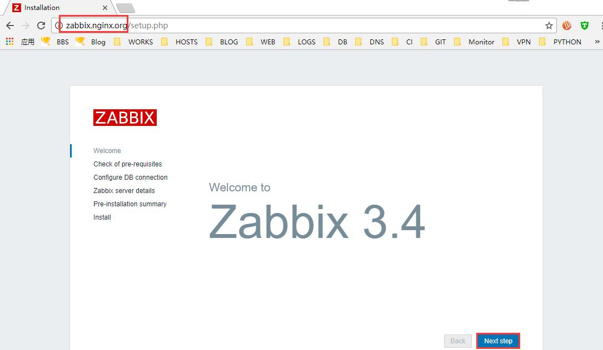
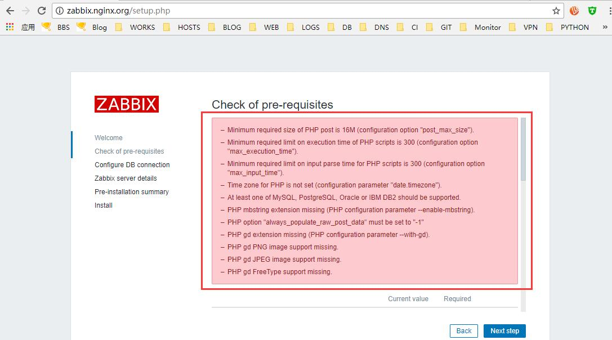
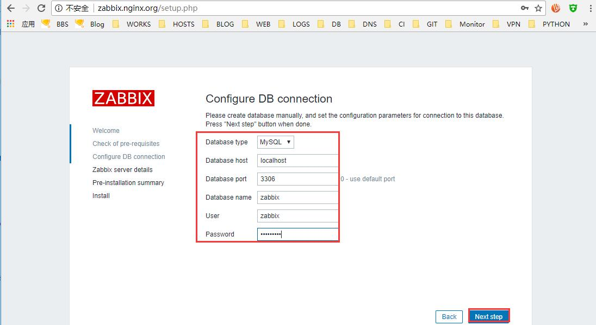
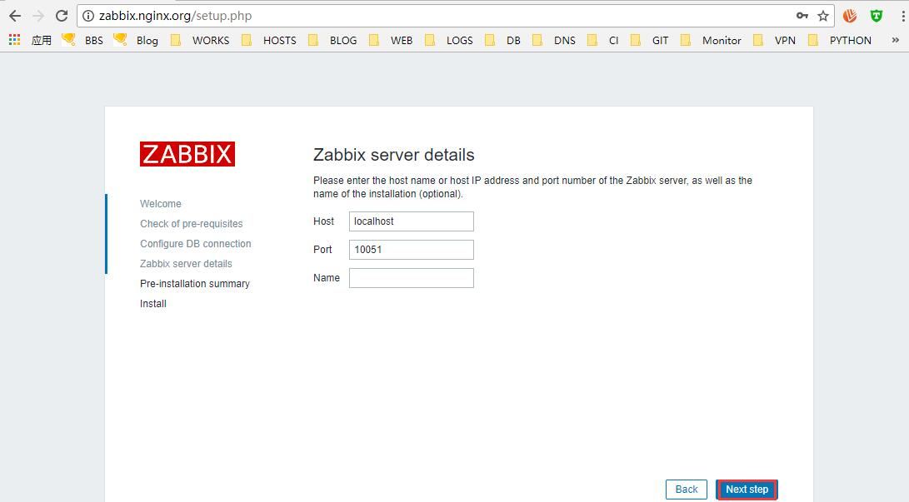
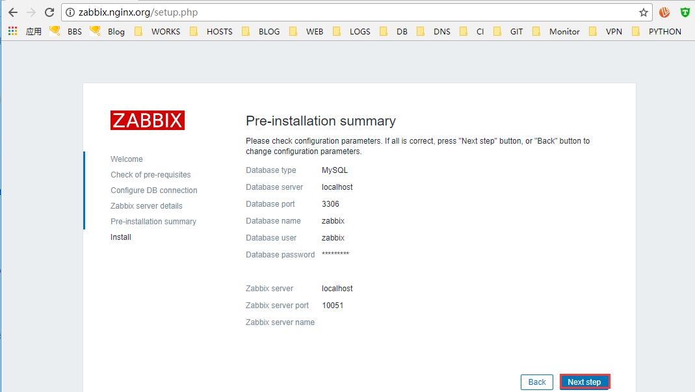
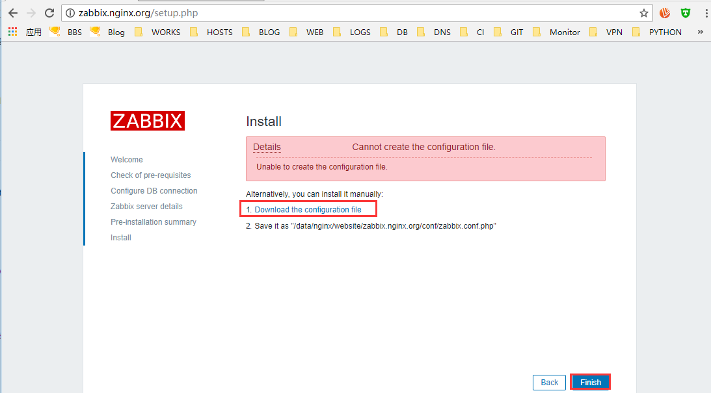
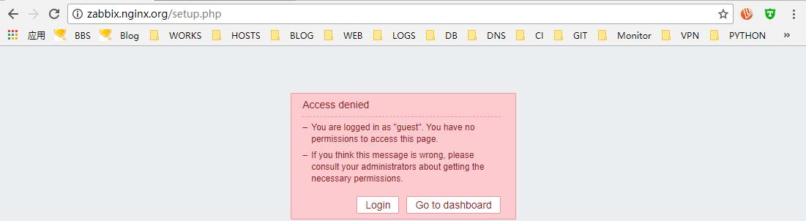
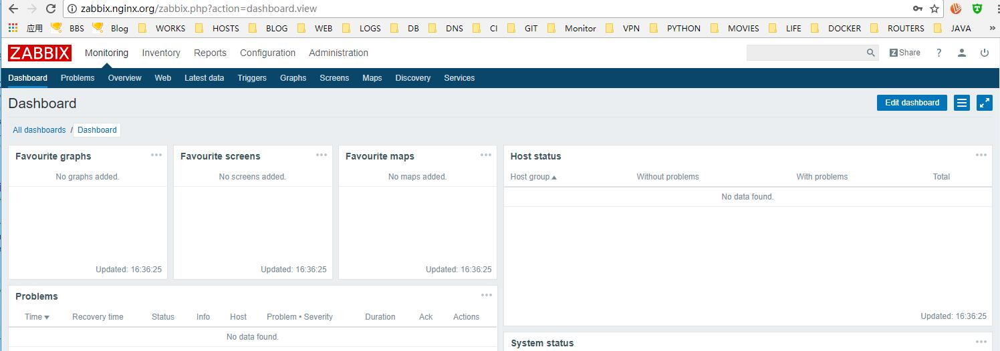

# 17.4：实操安装zabbix 监控

zabbix 是一套监控程序，基于PHP 开发。

1、从zabbix 官方下载zabbix 最新源码版：

```bash
[root@centos nginx-1.13.12]# wget -O /usr/local/src/zabbix-3.4.8.tar.gz https://jaist.dl.sourceforge.net/project/zabbix/ZABBIX%20Lat
--2018-04-16 03:14:36--  https://jaist.dl.sourceforge.net/project/zabbix/ZABBIX%20Latest%20Stable/3.4.8/zabbix-3.4.8.tar.gz
Resolving jaist.dl.sourceforge.net (jaist.dl.sourceforge.net)... 150.65.7.130, 2001:df0:2ed:feed::feed
Connecting to jaist.dl.sourceforge.net (jaist.dl.sourceforge.net)|150.65.7.130|:443... connected.
HTTP request sent, awaiting response... 200 OK
Length: 17289635 (16M) [application/x-gzip]
Saving to: ‘/usr/local/src/zabbix-3.4.8.tar.gz’

22% [=======================================================================================================>] 17,289,635   495KB/s   in 31s

2018-04-16 03:15:07 (553 KB/s) - ‘/usr/local/src/zabbix-3.4.8.tar.gz’ saved [17289635/17289635]
```

2、解压到下载目录：

```bash
[root@centos nginx-1.13.12]# tar -zxf /usr/local/src/zabbix-3.4.8.tar.gz -C /usr/local/src/
```

3、创建zabbix 项目存放目录：

```bash
[root@centos nginx-1.13.12]# mkdir /data/nginx/website/zabbix.nginx.org
```

4、复制zabbix 项目文件到 web 项目目录下;

```bash
[root@centos nginx-1.13.12]# cp /usr/local/src/zabbix-3.4.8/frontends/php/* /data/nginx/website/zabbix.nginx.org/ -r
```

5、在mysql 里面创建 zabbix 数据库：

```bash
[root@centos nginx-1.13.12]# mysql -uroot -p -e 'create database zabbix character set utf8'
Enter password:
```

授权zabbix 项目连接zabbix 数据库的用户;

```bash
[root@centos nginx-1.13.12]# mysql -uroot -p -e "grant all privileges on zabbix.* to 'zabbix'@'localhost' identified by 'zabbix123'"
Enter password:
[root@centos nginx-1.13.12]# mysql -uroot -p -e "flush privileges"
Enter password:
```

按下面的数据导入 zabbix 数据：

```bash
[root@centos nginx-1.13.12]# mysql -uzabbix -p  zabbix < /usr/local/src/zabbix-3.4.8/database/mysql/schema.sql
Enter password:
[root@centos nginx-1.13.12]# mysql -uzabbix -p  zabbix < /usr/local/src/zabbix-3.4.8/database/mysql/images.sql
Enter password:
[root@centos nginx-1.13.12]# mysql -uzabbix -p  zabbix < /usr/local/src/zabbix-3.4.8/database/mysql/data.sql
Enter password:
```

6、在 /usr/local/nginx/conf.d/ 目录下创建zabbix 项目的nginx 配置文件 zabbix.nginx.org.conf，内容为：

```bash
server {
    listen 80;
    server_name zabbix.nginx.org;

    root /data/nginx/website/zabbix.nginx.org;
    index index.htm index.html index.php;

    location / {
        root /data/nginx/website/zabbix.nginx.org;
        index index.htm index.html index.php;
    }

    location ~ \.php$ {
        root /data/nginx/website/zabbix.nginx.org;
        fastcgi_pass  127.0.0.1:9000;
        fastcgi_index index.php;
        fastcgi_param SCRIPT_FILENAME $document_root$fastcgi_script_name;
        include  fastcgi_params;
    }
}
```

7、检测nginx 配置，然后重载nginx:

```bash
[root@centos nginx-1.13.12]# /usr/local/nginx/sbin/nginx -t
nginx: the configuration file /usr/local/nginx/conf/nginx.conf syntax is ok
nginx: configuration file /usr/local/nginx/conf/nginx.conf test is successful
```

```bash
[root@centos nginx-1.13.12]# systemctl reload nginx
```

8、在本地做hosts 解析，然后用域名 zabbix.nginx.org 到web 端开始安装 zabbix:



检测安装zabbix 的安装环境：



安装报错，如下：

```bash
Minimum required size of PHP post is 16M (configuration option "post_max_size").
Minimum required limit on execution time of PHP scripts is 300 (configuration option "max_execution_time").
Minimum required limit on input parse time for PHP scripts is 300 (configuration option "max_input_time").
Time zone for PHP is not set (configuration parameter "date.timezone").
At least one of MySQL, PostgreSQL, Oracle or IBM DB2 should be supported.
PHP mbstring extension missing (PHP configuration parameter --enable-mbstring).
PHP option "always_populate_raw_post_data" must be set to "-1"
PHP gd extension missing (PHP configuration parameter --with-gd).
PHP gd PNG image support missing.
PHP gd JPEG image support missing.
PHP gd FreeType support missing.
```

解决方法：编辑 /usr/local/php/etc/php.ini 文件，做如下修改：

```bash
启用 date.timezone ，并指定值： date.timezone = Asia/shanghai
修改 post_max_size = 8M 为：post_max_size = 16M
修改 max_execution_time = 30 为：max_execution_time = 300
修改 max_input_time = 60 为：max_input_time = 300
启用 always_populate_raw_post_data = -1
```

修改保存退出。同时，进入php 解压目录，加参数：--enable-mbstring --with-gd --with-mysqli ，重新编译安装 php:

```bash
[root@centos conf]# ./configure --prefix=/usr/local/php --enable-fpm --with-fpm-user=php-fpm --with-fpm-group=php-fpm --enable-gcov --enable-debug --with-config-file-path=/usr/local/php/etc --with-libxml-dir=/usr/local/libxml2 --with-pcre-regex=/usr/local/pcre --with-zlib=/usr/local/zlib --enable-bcmath --with-curl=/usr/local/curl --with-jpeg-dir --with-png-dir --with-freetype-dir --with-gettext --with-mcrypt --enable-shmop --enable-soap  --enable-mysqlnd --enable-ftp -enable-sockets --enable-exif --disable-ipv6 --enable-mbstring --with-gd --with-mysqli
[root@centos php-5.6.35]# make
[root@centos php-5.6.35]# make isntall
```

重新加载下php-fpm:

```text
[root@centos php-5.6.35]# systemctl reload php-fpm
```

回到web 界面，点击 back 返回到上一步，然后点击下一步：


配置链接数据库：



设置zabbix 服务端的基础信息：



确认无误：



因为zabbix 配置文件目录 /data/nginx/website/zabbix.nginx.org/conf 没有可写权限，导致上面配置的内容无法写入改目录 。这里我们手动下载配置文件，然后上传到服务器的 /data/nginx/website/zabbix.nginx.org/conf 目录里面，完成后，点击finish.



到此，安装完成！因为我们用的是 guest 用户，无权限访问，点击 Login ，登录！



使用默认的账号密码：admin/zabbix 登录：




到这里。zabbix web 管理端安装完成。接下来，我们还要会服务器的 zabbix 解压目录，编译安装 zabbix 服务端！

9、回到服务器命令行，进入zabbix 解压目录：

```bash
[root@centos nginx-1.13.12]# cd /usr/local/src/zabbix-3.4.8
[root@centos zabbix-3.4.8]# ./configure --prefix=/usr/local/zabbix-server --enable-server --enable-agent --enable-java --with-mysql --with-libxml2 --with-net-snmp --with-libpcre --with-libcurl --with-libevent
```

编译参数检查报错：

```bash
checking for libperfstat 5.3.0.60 fileset... no
checking for architecture... linux (linux-gnu)
checking for the linux kernel version... unknown family (3.10.0-693.el7.x86_64)
checking size of void *... 8
checking for mysql_config... /usr/local/mysql/bin/mysql_config
checking for main in -lmariadb... no
configure: error: Not found mariadb library
```

解决方法：安装mariadb-devel mariadb-libs

```bash
[root@centos zabbix-3.4.8]# yum install -y mariadb-devel mariadb-libs
```

重新配置编译参数检查：

```bash
[root@centos zabbix-3.4.8]# ./configure --prefix=/usr/local/zabbix-server --enable-server --enable-agent --enable-java --with-mysql --with-libxml2 --with-net-snmp --with-libpcre --with-libcurl --with-libevent
```

报错：

```bash
checking pkg-config is at least version 0.9.0... yes
checking for xml2-config... no
configure: error: LIBXML2 library not found
```

解决方法：安装libxml2-devel curl-devel pcre-devel libevent-devel

```bash
[root@centos zabbix-3.4.8]# yum install -y libxml2-devel curl-devel pcre-devel libevent-devel
```

重新配置编译参数检查:

```bash
[root@centos zabbix-3.4.8]# ./configure --prefix=/usr/local/zabbix-server --enable-server --enable-agent --enable-java --with-mysql --with-libxml2 --with-net-snmp --with-libpcre --with-libcurl --with-libevent
```

报错：

```bash
[root@centos zabbix-3.4.8]# yum install -y  net-snmp net-snmp-devel net-snmp-libs
```

再次配置编译参数并编译安装：

```bash
[root@centos zabbix-3.4.8]#  ./configure --prefix=/usr/local/zabbix-server --enable-server --enable-agent --enable-java --with-mysql --with-libxml2 --with-net-snmp --with-libpcre --with-libcurl --with-libevent
[root@centos zabbix-3.4.8]# make
[root@centos zabbix-3.4.8]# make install
```

10、编辑zabbix\_server 主配置文件 /usr/local/zabbix-server/etc/zabbix\_server.conf ，配置其连接数据库：

```bash
ListenPort=10051
LogFile=/var/log/zabbix/zabbix_server.log
PidFile=/usr/local/zabbix-server/zabbix_server.pid
DBHost=localhost
DBName=zabbix
DBUser=zabbix
DBPassword=zabbix123
DBSocket=/tmp/mysql.sock
DBPort=3306
Timeout=4
LogSlowQueries=3000
User=zabbix
```

11、创建zabbix 日志存放目录，添加系统用户 zabbix ，禁止其登录系统：

```bash
[root@centos zabbix-3.4.8]# mkdir -p /var/log/zabbix
[root@centos zabbix-3.4.8]# useradd -s /sbin/nologin zabbix
[root@centos zabbix-3.4.8]# chown -R zabbix.zabbix /var/log/zabbix/
[root@centos zabbix-3.4.8]# chown -R zabbix.zabbix /usr/local/zabbix-server/
```

12、在 /usr/lib/systemd/system 目录创建zabbix-server 端启动的脚本文件：

```bash
[Unit]

Description=Zabbix Server with MySQL DB
After=syslog.target network.target mysqld.service

[Service]
Type=forking
ExecStart=/usr/local/zabbix-server/sbin/zabbix_server
User=zabbix
PIDFile=/usr/local/zabbix-server/zabbix_server.pid
ExecStop=/bin/kill -s QUIT $MAINPID
EeecReload=/bin/kill -s HUP $MAINPID

[Install]
WantedBy=multi-user.target
```

13、启动zabbix-server ：

```bash
[root@centos zabbix-3.4.8]#systemctl start zabbix-server
```

启动后，查看监听的进程及端口号：

```bash
[root@centos zabbix-3.4.8]# ps aux|egrep zabbix-server
zabbix    89592  0.0  0.3 220244  3420 ?        S    07:14   0:00 /usr/local/zabbix-server/sbin/zabbix_server
zabbix    89594  0.0  0.2 220240  2444 ?        S    07:14   0:00 /usr/local/zabbix-server/sbin/zabbix_server: configuration syncer [synced configuration in 0.004595 sec, idle 60 sec]
zabbix    89595  0.0  0.1 220244  1588 ?        S    07:14   0:00 /usr/local/zabbix-server/sbin/zabbix_server: alerter #1 started
zabbix    89596  0.0  0.1 220244  1588 ?        S    07:14   0:00 /usr/local/zabbix-server/sbin/zabbix_server: alerter #2 started
zabbix    89597  0.0  0.1 220244  1588 ?        S    07:14   0:00 /usr/local/zabbix-server/sbin/zabbix_server: alerter #3 started
zabbix    89598  0.0  0.1 220244  1580 ?        S    07:14   0:00 /usr/local/zabbix-server/sbin/zabbix_server: housekeeper [startup idle for 30 minutes]
zabbix    89599  0.0  0.2 220252  2228 ?        S    07:14   0:00 /usr/local/zabbix-server/sbin/zabbix_server: timer #1 [processed 0 triggers, 0 events in 0.000006 sec, 0 maintenances in 0.000000 sec, idle 30 sec]
zabbix    89600  0.0  0.2 220240  2120 ?        S    07:14   0:00 /usr/local/zabbix-server/sbin/zabbix_server: http poller #1 [got 0 values in 0.000256 sec, idle 5 sec]
zabbix    89601  0.0  0.4 324716  4268 ?        S    07:14   0:00 /usr/local/zabbix-server/sbin/zabbix_server: discoverer #1 [processed 0 rules in 0.000515 sec, idle 60 sec]
zabbix    89602  0.0  0.2 220236  2092 ?        S    07:14   0:00 /usr/local/zabbix-server/sbin/zabbix_server: history syncer #1 [synced 0 items in 0.000000 sec, idle 1 sec]
zabbix    89603  0.0  0.2 220236  2092 ?        S    07:14   0:00 /usr/local/zabbix-server/sbin/zabbix_server: history syncer #2 [synced 0 items in 0.000001 sec, idle 1 sec]
zabbix    89604  0.0  0.2 220236  2092 ?        S    07:14   0:00 /usr/local/zabbix-server/sbin/zabbix_server: history syncer #3 [synced 0 items in 0.000001 sec, idle 1 sec]
zabbix    89605  0.0  0.2 220236  2092 ?        S    07:14   0:00 /usr/local/zabbix-server/sbin/zabbix_server: history syncer #4 [synced 0 items in 0.000000 sec, idle 1 sec]
zabbix    89606  0.0  0.2 220240  2112 ?        S    07:14   0:00 /usr/local/zabbix-server/sbin/zabbix_server: escalator #1 [processed 0 escalations in 0.000713 sec, idle 3 sec]
zabbix    89607  0.0  0.2 220236  2104 ?        S    07:14   0:00 /usr/local/zabbix-server/sbin/zabbix_server: proxy poller #1 [exchanged data with 0 proxies in 0.000003 sec, idle 5 sec]
zabbix    89608  0.0  0.2 220244  1896 ?        S    07:14   0:00 /usr/local/zabbix-server/sbin/zabbix_server: self-monitoring [processed data in 0.000003 sec, idle 1 sec]
zabbix    89609  0.0  0.2 220236  2120 ?        S    07:14   0:00 /usr/local/zabbix-server/sbin/zabbix_server: task manager [processed 0 task(s) in 0.000212 sec, idle 5 sec]
zabbix    89610  0.0  0.4 326000  4272 ?        S    07:14   0:00 /usr/local/zabbix-server/sbin/zabbix_server: poller #1 [got 0 values in 0.000005 sec, idle 5 sec]
zabbix    89611  0.0  0.4 326000  4272 ?        S    07:14   0:00 /usr/local/zabbix-server/sbin/zabbix_server: poller #2 [got 0 values in 0.000006 sec, idle 5 sec]
zabbix    89612  0.0  0.4 326000  4272 ?        S    07:14   0:00 /usr/local/zabbix-server/sbin/zabbix_server: poller #3 [got 0 values in 0.000003 sec, idle 5 sec]
zabbix    89613  0.0  0.4 326000  4272 ?        S    07:14   0:00 /usr/local/zabbix-server/sbin/zabbix_server: poller #4 [got 0 values in 0.000003 sec, idle 5 sec]
zabbix    89614  0.0  0.4 326000  4272 ?        S    07:14   0:00 /usr/local/zabbix-server/sbin/zabbix_server: poller #5 [got 0 values in 0.000003 sec, idle 5 sec]
zabbix    89615  0.0  0.4 326000  4272 ?        S    07:14   0:00 /usr/local/zabbix-server/sbin/zabbix_server: unreachable poller #1 [got 0 values in 0.000004 sec, idle 5 sec]
zabbix    89616  0.0  0.2 220236  2376 ?        S    07:14   0:00 /usr/local/zabbix-server/sbin/zabbix_server: trapper #1 [processed data in 0.000221 sec, waiting for connection]
zabbix    89617  0.0  0.2 220236  2376 ?        S    07:14   0:00 /usr/local/zabbix-server/sbin/zabbix_server: trapper #2 [processed data in 0.000198 sec, waiting for connection]
zabbix    89618  0.0  0.1 220244  1812 ?        S    07:14   0:00 /usr/local/zabbix-server/sbin/zabbix_server: trapper #3 [processed data in 0.000000 sec, waiting for connection]
zabbix    89619  0.0  0.1 220244  1812 ?        S    07:14   0:00 /usr/local/zabbix-server/sbin/zabbix_server: trapper #4 [processed data in 0.000000 sec, waiting for connection]
zabbix    89620  0.0  0.2 220236  2324 ?        S    07:14   0:00 /usr/local/zabbix-server/sbin/zabbix_server: trapper #5 [processed data in 0.000158 sec, waiting for connection]
zabbix    89621  0.0  0.2 221636  1928 ?        S    07:14   0:00 /usr/local/zabbix-server/sbin/zabbix_server: icmp pinger #1 [got 0 values in 0.000003 sec, idle 5 sec]
zabbix    89622  0.0  0.2 220244  2300 ?        S    07:14   0:00 /usr/local/zabbix-server/sbin/zabbix_server: alert manager #1 [sent 0, failed 0 alerts, idle 5.006882 sec during 5.006884 sec]
zabbix    89623  0.0  0.2 220244  2108 ?        S    07:14   0:00 /usr/local/zabbix-server/sbin/zabbix_server: preprocessing manager #1 [queued 0, processed 0 values, idle 5.005220 sec during 5.005222 sec]
zabbix    89624  0.0  0.1 220244  1796 ?        S    07:14   0:00 /usr/local/zabbix-server/sbin/zabbix_server: preprocessing worker #1 started
zabbix    89625  0.0  0.1 220244  1796 ?        S    07:14   0:00 /usr/local/zabbix-server/sbin/zabbix_server: preprocessing worker #2 started
zabbix    89626  0.0  0.1 220244  1796 ?        S    07:14   0:00 /usr/local/zabbix-server/sbin/zabbix_server: preprocessing worker #3 started
root      89663  0.0  0.1 112664   980 pts/4    S+   07:44   0:00 grep -E --color=auto zabbix-server
```

```bash
[root@centos zabbix-3.4.8]# ss -lntp|egrep zabbix
LISTEN     0      128          *:10051                    *:*                   users:(("zabbix_server",pid=89626,fd=4),("zabbix_server",pid=89625,fd=4),("zabbix_server",pid=89624,fd=4),("zabbix_server",pid=89623,fd=4),("zabbix_server",pid=89622,fd=4),("zabbix_server",pid=89621,fd=4),("zabbix_server",pid=89620,fd=4),("zabbix_server",pid=89619,fd=4),("zabbix_server",pid=89618,fd=4),("zabbix_server",pid=89617,fd=4),("zabbix_server",pid=89616,fd=4),("zabbix_server",pid=89615,fd=4),("zabbix_server",pid=89614,fd=4),("zabbix_server",pid=89613,fd=4),("zabbix_server",pid=89612,fd=4),("zabbix_server",pid=89611,fd=4),("zabbix_server",pid=89610,fd=4),("zabbix_server",pid=89609,fd=4),("zabbix_server",pid=89608,fd=4),("zabbix_server",pid=89607,fd=4),("zabbix_server",pid=89606,fd=4),("zabbix_server",pid=89605,fd=4),("zabbix_server",pid=89604,fd=4),("zabbix_server",pid=89603,fd=4),("zabbix_server",pid=89602,fd=4),("zabbix_server",pid=89601,fd=4),("zabbix_server",pid=89600,fd=4),("zabbix_server",pid=89599,fd=4),("zabbix_server",pid=89598,fd=4),("zabbix_server",pid=89597,fd=4),("zabbix_server",pid=89596,fd=4),("zabbix_server",pid=89595,fd=4),("zabbix_server",pid=89594,fd=4),("zabbix_server",pid=89592,fd=4))
```

