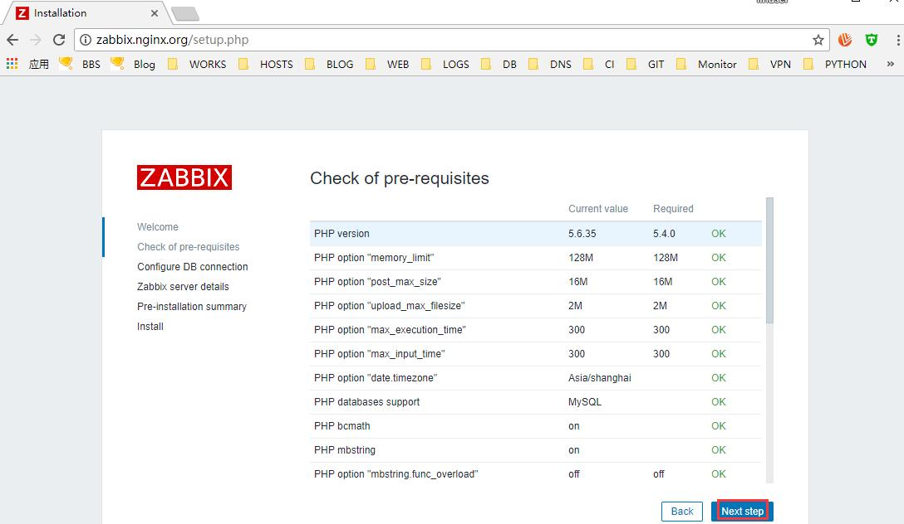

# 17.4：实操安装zabbix 监控

zabbix 是一套监控程序，基于PHP 开发。

1、从zabbix 官方下载zabbix 最新源码版：

```bash
[root@centos nginx-1.13.12]# wget -O /usr/local/src/zabbix-3.4.8.tar.gz https://jaist.dl.sourceforge.net/project/zabbix/ZABBIX%20Lat
--2018-04-16 03:14:36--  https://jaist.dl.sourceforge.net/project/zabbix/ZABBIX%20Latest%20Stable/3.4.8/zabbix-3.4.8.tar.gz
Resolving jaist.dl.sourceforge.net (jaist.dl.sourceforge.net)... 150.65.7.130, 2001:df0:2ed:feed::feed
Connecting to jaist.dl.sourceforge.net (jaist.dl.sourceforge.net)|150.65.7.130|:443... connected.
HTTP request sent, awaiting response... 200 OK
Length: 17289635 (16M) [application/x-gzip]
Saving to: ‘/usr/local/src/zabbix-3.4.8.tar.gz’

22% [=======================================================================================================>] 17,289,635   495KB/s   in 31s

2018-04-16 03:15:07 (553 KB/s) - ‘/usr/local/src/zabbix-3.4.8.tar.gz’ saved [17289635/17289635]
```

2、解压到下载目录：

```bash
[root@centos nginx-1.13.12]# tar -zxf /usr/local/src/zabbix-3.4.8.tar.gz -C /usr/local/src/
```

3、创建zabbix 项目存放目录：

```bash
[root@centos nginx-1.13.12]# mkdir /data/nginx/website/zabbix.nginx.org
```

4、复制zabbix 项目文件到 web 项目目录下;

```bash
[root@centos nginx-1.13.12]# cp /usr/local/src/zabbix-3.4.8/frontends/php/* /data/nginx/website/zabbix.nginx.org/ -r
```

5、在mysql 里面创建 zabbix 数据库：

```bash
[root@centos nginx-1.13.12]# mysql -uroot -p -e 'create database zabbix character set utf8'
Enter password:
```

授权zabbix 项目连接zabbix 数据库的用户;

```bash
[root@centos nginx-1.13.12]# mysql -uroot -p -e "grant all privileges on zabbix.* to 'zabbix'@'localhost' identified by 'zabbix123'"
Enter password:
[root@centos nginx-1.13.12]# mysql -uroot -p -e "flush privileges"
Enter password:
```

按下面的数据导入 zabbix 数据：

```bash
[root@centos nginx-1.13.12]# mysql -uzabbix -p  zabbix < /usr/local/src/zabbix-3.4.8/database/mysql/schema.sql
Enter password:
[root@centos nginx-1.13.12]# mysql -uzabbix -p  zabbix < /usr/local/src/zabbix-3.4.8/database/mysql/images.sql
Enter password:
[root@centos nginx-1.13.12]# mysql -uzabbix -p  zabbix < /usr/local/src/zabbix-3.4.8/database/mysql/data.sql
Enter password:
```

6、在 /usr/local/nginx/conf.d/ 目录下创建zabbix 项目的nginx 配置文件 zabbix.nginx.org.conf，内容为：

```bash
server {
    listen 80;
    server_name zabbix.nginx.org;

    root /data/nginx/website/zabbix.nginx.org;
    index index.htm index.html index.php;

    location / {
        root /data/nginx/website/zabbix.nginx.org;
        index index.htm index.html index.php;
    }

    location ~ \.php$ {
        root /data/nginx/website/zabbix.nginx.org;
        fastcgi_pass  127.0.0.1:9000;
        fastcgi_index index.php;
        fastcgi_param SCRIPT_FILENAME $document_root$fastcgi_script_name;
        include  fastcgi_params;
    }
}
```

7、检测nginx 配置，然后重载nginx:

```bash
[root@centos nginx-1.13.12]# /usr/local/nginx/sbin/nginx -t
nginx: the configuration file /usr/local/nginx/conf/nginx.conf syntax is ok
nginx: configuration file /usr/local/nginx/conf/nginx.conf test is successful
```

```bash
[root@centos nginx-1.13.12]# systemctl reload nginx
```

8、在本地做hosts 解析，然后用域名 zabbix.nginx.org 到web 端开始安装 zabbix:


安装报错，如下：

```bash
Minimum required size of PHP post is 16M (configuration option "post_max_size").
Minimum required limit on execution time of PHP scripts is 300 (configuration option "max_execution_time").
Minimum required limit on input parse time for PHP scripts is 300 (configuration option "max_input_time").
Time zone for PHP is not set (configuration parameter "date.timezone").
At least one of MySQL, PostgreSQL, Oracle or IBM DB2 should be supported.
PHP mbstring extension missing (PHP configuration parameter --enable-mbstring).
PHP option "always_populate_raw_post_data" must be set to "-1"
PHP gd extension missing (PHP configuration parameter --with-gd).
PHP gd PNG image support missing.
PHP gd JPEG image support missing.
PHP gd FreeType support missing.
```

解决方法：编辑 /usr/local/php/etc/php.ini 文件，做如下修改：

```bash
启用 date.timezone ，并指定值： date.timezone = Asia/shanghai
修改 post_max_size = 8M 为：post_max_size = 16M
修改 max_execution_time = 30 为：max_execution_time = 300
修改 max_input_time = 60 为：max_input_time = 300
启用 always_populate_raw_post_data = -1
```

修改保存退出。同时，进入php 解压目录，加参数：--enable-mbstring --with-gd --with-mysqli ，重新编译安装 php:

```bash
[root@centos conf]# ./configure --prefix=/usr/local/php --enable-fpm --with-fpm-user=php-fpm --with-fpm-group=php-fpm --enable-gcov --enable-debug --with-config-file-path=/usr/local/php/etc --with-libxml-dir=/usr/local/libxml2 --with-pcre-regex=/usr/local/pcre --with-zlib=/usr/local/zlib --enable-bcmath --with-curl=/usr/local/curl --with-jpeg-dir --with-png-dir --with-freetype-dir --with-gettext --with-mcrypt --enable-shmop --enable-soap  --enable-mysqlnd --enable-ftp -enable-sockets --enable-exif --disable-ipv6 --enable-mbstring --with-gd --with-mysqli
[root@centos php-5.6.35]# make
[root@centos php-5.6.35]# make isntall
```

重新加载下php-fpm:

```text
[root@centos php-5.6.35]# systemctl reload php-fpm
```

回到web 界面，点击 back 返回到上一步，然后点击下一步：



配置链接数据库：


设置zabbix 服务端的基础信息：


确认无误：


因为zabbix 配置文件目录 /data/nginx/website/zabbix.nginx.org/conf 没有可写权限，导致上面配置的内容无法写入改目录  。这里我们手动下载配置文件，然后上传到服务器的   /data/nginx/website/zabbix.nginx.org/conf 目录里面，完成后，点击finish.


到此，安装完成！因为我们用的是 guest 用户，无权限访问，点击 Login ，登录！


使用默认的账号密码：admin/zabbix 登录：


