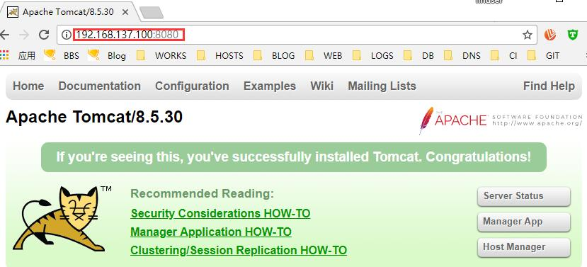

# 15.2：Tomcat的安装

从tomcat 官网下载二进制包到 /usr/local/src 目录下：

```bash
 wget -O /usr/local/src//apache-tomcat-8.5.30.tar.gz http://mirror.ventraip.net.au/apache/tomcat/tomcat-8/v8.5.30/bin/apache-tomcat-8.5.30.tar.gz
```

解压到下载目录：

```bash
 tar -zxf /usr/local/src/apache-tomcat-8.5.30.tar.gz -C /usr/local/src/
```

移动解压目录并重命名为 tomcat:

```bash
mv /usr/local/src/apache-tomcat-8.5.30 /usr/local/tomcat
```

创建优化配置文件 /usr/local/tomcat/bin/setenv.sh，内容如下：

```bash
#!/usr/bin/env bash

set -e

#添加JAVA_HOME
JAVA_HOME=/usr/local/jdk1.8.0_161

#定义 tomcat pid 所在目录
CATALINA_PID="/usr/local/tomcat/tomcat.pid"

#设置 java opts
JAVA_OPTS="-server -Xms256m -Xmx1024m -XX:PermSize=256m -XX:MaxPermSize=1024m -Dfile.encoding=UTF-8 -Duser.timezone=GMT+08 -Djava.security.egd=file:/dev/./urandom"
```

赋予该文件可执行权限：

```bash
chmod 755 /usr/local/tomcat/bin/setenv.sh
```

 为了安全起见，我们添加运行tomcat 的普通用户 tomcat,并赋予登录系统权限，同时修改 tomcat 目录所属主合组都为 tomcat:

```bash
useradd -s /bin/bash tomcat
chown -R tomcat.tomcat /usr/local/tomcat
```

创建系统启动脚本：

```text
cat << eof > /usr/lib/systemd/system/tomcat.service
[Unit]
Description=tomcat
After=syslog.target network.target remote-fs.target nss-lookup.target

[Service]
User=tomcat
Type=forking
PIDFile=/usr/local/tomcat/tomcat.pid
ExecStart=/usr/local/tomcat/bin/startup.sh
ExecReload=/bin/kill -s HUP $MAINPID
ExecStop=/bin/kill -s QUIT $MAINPID
PrivateTmp=true

[Install]
WantedBy=multi-user.target
eof
```

启动tomcat:

```bash
[root@centos ~]#  systemctl start tomcat
```

查看启动进程及验证有启动 8080 端口：

```bash
[root@centos ~]# ps aux|egrep tomcat
tomcat     1807  2.2 16.0 3093868 149696 ?      Sl   07:22   0:02 /usr/local/jdk1.8.0_161/bin/java -Djava.util.logging.config.file=/usr/local/tomcat/conf/logging.properties -Djava.util.logging.manager=org.apache.juli.ClassLoaderLogManager -server -Xms256m -Xmx1024m -XX:PermSize=256m -XX:MaxPermSize=1024m -Dfile.encoding=UTF-8 -Duser.timezone=GMT+08 -Djava.security.egd=file:/dev/./urandom -Djdk.tls.ephemeralDHKeySize=2048 -Djava.protocol.handler.pkgs=org.apache.catalina.webresources -Dorg.apache.catalina.security.SecurityListener.UMASK=0027 -Dignore.endorsed.dirs= -classpath /usr/local/tomcat/bin/bootstrap.jar:/usr/local/tomcat/bin/tomcat-juli.jar -Dcatalina.base=/usr/local/tomcat -Dcatalina.home=/usr/local/tomcat -Djava.io.tmpdir=/usr/local/tomcat/temp org.apache.catalina.startup.Bootstrap start
```

```bash
[root@centos ~]# ss -lntp |egrep 8080
LISTEN     0      100         :::8080                    :::*                   users:(("java",pid=1807,fd=49))
```

开放防火墙 8080 端口，测试访问：

```bash
[root@centos ~]# firewall-cmd --add-port=8080/tcp
succes

```



