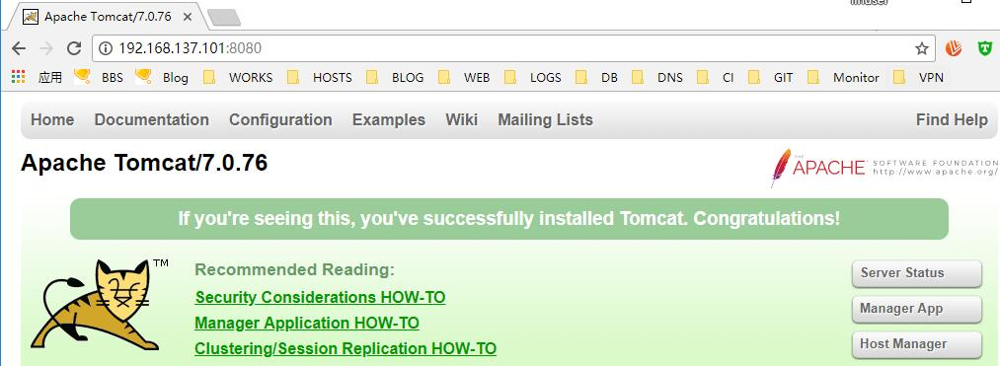

# 15.3：使用 yum 安装tomcat 环境

直接在初始化环境的服务器上执行如下命令进行安装：

```bash
yum install -y java-1.8.0-openjdk java-1.8.0-openjdk-devel tomcat tomcat-admin-webapps tomcat-docs-webapp tomcat-lib tomcat-webapps
```

说明：

```text
java-1.8.0-openjdk       #java 环境包
tomcat                   #tomat 核心包
tomcat-admin-webapps     #tomcat 项目管理配置内容
tomcat-docs-webapp       #tomcat 项目文档
tomcat-webapps           #tomcat 项目目录
```

安装完成，可以看到tomcat 被安装在如下目录：

```bash
[root@centos ~]# ls /usr/share/tomcat/ -al
total 4
drwxrwxr-x.  3 root tomcat   91 Apr 12 07:42 .
drwxr-xr-x. 93 root root   4096 Apr 12 07:42 ..
drwxr-xr-x.  2 root root     76 Apr 12 07:42 bin
lrwxrwxrwx.  1 root tomcat   11 Apr 12 07:42 conf -> /etc/tomcat
lrwxrwxrwx.  1 root tomcat   22 Apr 12 07:42 lib -> /usr/share/java/tomcat
lrwxrwxrwx.  1 root tomcat   15 Apr 12 07:42 logs -> /var/log/tomcat
lrwxrwxrwx.  1 root tomcat   22 Apr 12 07:42 temp -> /var/cache/tomcat/temp
lrwxrwxrwx.  1 root tomcat   23 Apr 12 07:42 webapps -> /var/lib/tomcat/webapps
lrwxrwxrwx.  1 root tomcat   22 Apr 12 07:42 work -> /var/cache/tomcat/work
```

java 环境也自动配置好了：

```bash
[root@centos ~]# java -version
openjdk version "1.8.0_161"
OpenJDK Runtime Environment (build 1.8.0_161-b14)
OpenJDK 64-Bit Server VM (build 25.161-b14, mixed mode)
```

可以看下tomcat 启动脚本：

```bash
[root@centos ~]# cat /usr/lib/systemd/system/tomcat.service
# Systemd unit file for default tomcat
#
# To create clones of this service:
# DO NOTHING, use tomcat@.service instead.

[Unit]
Description=Apache Tomcat Web Application Container
After=syslog.target network.target

[Service]
Type=simple
EnvironmentFile=/etc/tomcat/tomcat.conf
Environment="NAME="
EnvironmentFile=-/etc/sysconfig/tomcat
ExecStart=/usr/libexec/tomcat/server start
SuccessExitStatus=143
User=tomcat
Group=tomcat


[Install]
WantedBy=multi-user.target
```

启动tomcat

```text
[root@centos ~]# systemctl start tomcat.service
```

查看启动进程及监听的端口：

```bash
tomcat     1669 89.0  8.5 2266372 79420 ?       Ssl  07:47   0:04 /usr/lib/jvm/jre/bin/java -classpath /usr/share/tomcat/bin/bootstrap.jar:/usr/share/tomcat/bin/tomcat-juli.jar:/usr/share/java/commons-daemon.jar -Dcatalina.base=/usr/share/tomcat -Dcatalina.home=/usr/share/tomcat -Djava.endorsed.dirs= -Djava.io.tmpdir=/var/cache/tomcat/temp -Djava.util.logging.config.file=/usr/share/tomcat/conf/logging.properties -Djava.util.logging.manager=org.apache.juli.ClassLoaderLogManager org.apache.catalina.startup.Bootstrap start
root       1700  0.0  0.1 112660   972 pts/0    R+   07:47   0:00 grep -E --color=auto tomcat
```

```bash
[root@centos ~]# ss -lntp |egrep 8080
LISTEN     0      100         :::8080                    :::*                   users:(("java",pid=1669,fd=49))
```

防火墙开放8080 端口，测试访问tomcat:

```bash
[root@centos ~]# firewall-cmd --add-port=8080/tcp
success
```



