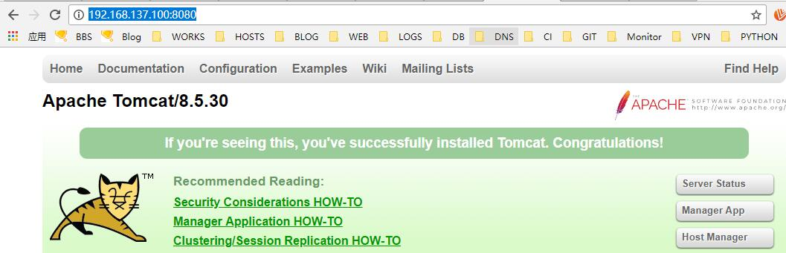
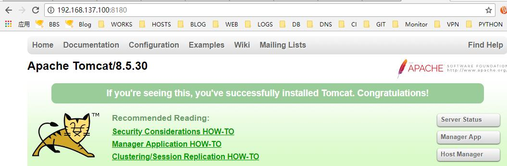

# 15.5：配置虚拟主机

**绑定IP，监听单个IP**

默认情况下，服务器上的tomcat 会监控服务器上的所有服务器。这就导致了我使用服务器上所有IP + 端口都可以访问到该tomcat 项目。为避免出现这样的情况。我们可以指定tomcat 绑定单个IP，即：tomcat 只监听某个IP 的8080 端口。

1、编辑 tomcat 主配置文件 /usr/local/tomcat/conf/server.xml ，找到配置文件文件中 &lt;Connector port="8080" protocol="HTTP/1.1" connectionTimeout="20000"  redirectPort="8443" /&gt;  段，增加 address= 参数：

```bash
    <Connector port="8080" protocol="HTTP/1.1"
               address="192.168.137.101"
               connectionTimeout="20000"
               redirectPort="8443" />
```

修改好，保存退出。重启下tomcat:

```bash
[root@centos ~]# systemctl restart tomcat
```

2、在服务器上查看监听的IP及端口：

```bash
[root@centos ~]# ss -lntp |egrep java
LISTEN     0      100     ::ffff:192.168.137.101:8080                    :::*                   users:(("java",pid=1942,fd=49))
LISTEN     0      1         ::ffff:127.0.0.1:8005                    :::*                   users:(("java",pid=1942,fd=70))
LISTEN     0      100         :::8009                    :::*                   users:(("java",pid=1942,fd=54))
```

3、测试访问，使用IP 192.168.137.101:8080 访问tomcat 项目，可以正常访问。


但是使用该服务器上的其它IP 地址访问，则无法访问：


**绑定域名**

tomcat 默认绑定的域名是localhost ，即使用该服务器上的IP 就可以访问tomcat 项目，但是有时候我们需要绑定域名，以便区分多个项目（其实这种情况基本不会出现，这里只是教大家怎么配置域名）.注：如果该配置文件中，有绑定IP 地址的话，则必须使用该IP地址做解析，然后加绑定域名方可访问：

1、编辑tomcat 主配置文件 /usr/local/tomcat/conf/server.xml ，找到配置文件文件中 &lt;Host name="localhost"  appBase="webapps"  unpackWARs="true" autoDeploy="true"&gt; 段，将 localhost 修改成要绑定的域名：

```bash
     <Host name="host1.tomcat.org"  appBase="webapps"
            unpackWARs="true" autoDeploy="true">
```

2、重启 tocmat"

```bash
[root@centos ~]# systemctl restart tomcat
```

3、做好本地解析后（注，绑定的IP 和域名）。在浏览器中使用域名，可以正常访问：


使用绑定的IP访问，无法访问：


**更换项目路径**

默认项目都在 tomcat 目录的 webapps 目录下，这里教大家怎么修改项目的默认路径，即如果项目不放在 tomcat 的 webapps 目录下该如何让 tomcat 也能识别解析

1、编辑 tomcat 主配置文件 /usr/local/tomcat/conf/server.xml ，找到配置文件文件中 &lt;Host name="localhost" appBase="webapps" unpackWARs="true" autoDeploy="true"&gt; 段，在其下面添加以下配置：

```java
<Context path="" docBase="/data/tomcat/host1" debug="0" reloadable="true" crossContext="true"/>
```

docBase : 指定项目路径

保存退出！重启tomcat 服务：

```bash
[root@centos ~]# systemctl restart tomcat
```

2、创建项目目录

```bash
[root@centos ~]# mkdir -p /data/tomcat/{host1,host2}
```

并创建测试项目文件 index.jsp:

```java
<html><body><center>
Now time is: <%=new java.util.Date()%>
</center></body></html>
```

3、浏览器测试访问（注意使用绑定的IP 地址及虚拟主机绑定的域名）：


**配置虚拟主机（在tomcat 项目这是不被建议使用的，因为只要重启tomcat,所有的项目都会被重启）**

尽管这种方式是不被大家认同的，但是还是教下大家如何配置。具体如下;

1、 编辑 tomcat 主配置文件 /usr/local/tomcat/conf/server.xml ，找到配置文件文件中 &lt;Host name="localhost" appBase="webapps" unpackWARs="true" autoDeploy="true"&gt; ......中间略  ......&lt;/Host&gt;

 段，在下面添加：

```java
            <Host name="host2.tomcat.org"  appBase="webapps"
            unpackWARs="true" autoDeploy="true">
      <Context path="" docBase="/data/tomcat/host2" debug="0" reloadable="true" crossContext="true"/>
        <Valve className="org.apache.catalina.valves.AccessLogValve" directory="logs"
               prefix="localhost_access_log" suffix=".txt"
```

完整配置：

```text
      <!--     HOST1     -->
      <Host name="host1.tomcat.org"  appBase="webapps"
            unpackWARs="true" autoDeploy="true">
      <Context path="" docBase="/data/tomcat/host1" debug="0" reloadable="true" crossContext="true"/>
        <!-- SingleSignOn valve, share authentication between web applications
             Documentation at: /docs/config/valve.html -->
        <!--
        <Valve className="org.apache.catalina.authenticator.SingleSignOn" />
        -->

        <!-- Access log processes all example.
             Documentation at: /docs/config/valve.html
             Note: The pattern used is equivalent to using pattern="common" -->
        <Valve className="org.apache.catalina.valves.AccessLogValve" directory="logs"
               prefix="localhost_access_log" suffix=".txt"
               pattern="%h %l %u %t &quot;%r&quot; %s %b" />

      </Host>
    
      <!--    HOST2    -->
      <Host name="host2.tomcat.org"  appBase="webapps"
            unpackWARs="true" autoDeploy="true">
      <Context path="" docBase="/data/tomcat/host2" debug="0" reloadable="true" crossContext="true"/>
        <Valve className="org.apache.catalina.valves.AccessLogValve" directory="logs"
               prefix="localhost_access_log" suffix=".txt"
               pattern="%h %l %u %t &quot;%r&quot; %s %b" />
      </Host>

```

2、 保存退出！重启tomcat 服务：

```bash
[root@centos ~]# systemctl restart tomcat
```

3、在虚拟主机项目2 的目录下创建测试文件 index.jsp， 内容为：

```java
<html>
<head><title>TomcatA</title></head>
  <body>
    <h1><fontcolor="red">TomcatA </font></h1>
    <tableborder="1">
      <tr>
        <td>Session ID</td>
    <%session.setAttribute("abc","abc"); %>
        <td><%= session.getId()%></td>
      </tr>
      <tr>
        <td>Created on</td>
        <td><%=session.getCreationTime() %></td>
     </tr>
    </table>
  </body>
</html>
```

4、测试访问：

host1.tomcat.org:


host2.tomcat.org


**单机多项目（tomcat）共存：**

怎么样让一台服务器上运行多个tomcat 呢？ 其实我们只需要修改每个 tomcat 的端口号不一致即可。

1、复制之前的tomcat 为新的tomcat-1:

```bash
[root@centos ~]# cp -r /usr/local/tomcat /usr/local/tomcat-1
```

编辑 /usr/local/tomcat-1/bin/setenv.sh 文件，内容为：

```bash
#!/usr/bin/env bash

set -e

#添加JAVA_HOME
JAVA_HOME=/usr/local/jdk1.8.0_161

#定义 tomcat pid 所在目录
CATALINA_PID="/usr/local/tomcat-1/tomcat.pid"

#设置 java opts
JAVA_OPTS="-server -Xms256m -Xmx1024m -XX:PermSize=256m -XX:MaxPermSize=1024m -Dfile.encoding=UTF-8 -Duser.timezone=GMT+08 -Djava.security.egd=file:/dev/./urandom"
```

编辑 tomcat 主配置文件 /usr/local/tomcat-1/conf/server.xml，将该配置文件中的端口都修改为唯一，这里我统一在原基础上加100，即配置内容为：

```java
<?xml version="1.0" encoding="UTF-8"?>
<!--
  Licensed to the Apache Software Foundation (ASF) under one or more
  contributor license agreements.  See the NOTICE file distributed with
  this work for additional information regarding copyright ownership.
  The ASF licenses this file to You under the Apache License, Version 2.0
  (the "License"); you may not use this file except in compliance with
  the License.  You may obtain a copy of the License at

      http://www.apache.org/licenses/LICENSE-2.0

  Unless required by applicable law or agreed to in writing, software
  distributed under the License is distributed on an "AS IS" BASIS,
  WITHOUT WARRANTIES OR CONDITIONS OF ANY KIND, either express or implied.
  See the License for the specific language governing permissions and
  limitations under the License.
-->
<!-- Note:  A "Server" is not itself a "Container", so you may not
     define subcomponents such as "Valves" at this level.
     Documentation at /docs/config/server.html
 -->
<Server port="8105" shutdown="SHUTDOWN">
  <Listener className="org.apache.catalina.startup.VersionLoggerListener" />
  <!-- Security listener. Documentation at /docs/config/listeners.html
  <Listener className="org.apache.catalina.security.SecurityListener" />
  -->
  <!--APR library loader. Documentation at /docs/apr.html -->
  <Listener className="org.apache.catalina.core.AprLifecycleListener" SSLEngine="on" />
  <!-- Prevent memory leaks due to use of particular java/javax APIs-->
  <Listener className="org.apache.catalina.core.JreMemoryLeakPreventionListener" />
  <Listener className="org.apache.catalina.mbeans.GlobalResourcesLifecycleListener" />
  <Listener className="org.apache.catalina.core.ThreadLocalLeakPreventionListener" />

  <!-- Global JNDI resources
       Documentation at /docs/jndi-resources-howto.html
  -->
  <GlobalNamingResources>
    <!-- Editable user database that can also be used by
         UserDatabaseRealm to authenticate users
    -->
    <Resource name="UserDatabase" auth="Container"
              type="org.apache.catalina.UserDatabase"
              description="User database that can be updated and saved"
              factory="org.apache.catalina.users.MemoryUserDatabaseFactory"
              pathname="conf/tomcat-users.xml" />
  </GlobalNamingResources>

  <!-- A "Service" is a collection of one or more "Connectors" that share
       a single "Container" Note:  A "Service" is not itself a "Container",
       so you may not define subcomponents such as "Valves" at this level.
       Documentation at /docs/config/service.html
   -->
  <Service name="Catalina">

    <!--The connectors can use a shared executor, you can define one or more named thread pools-->
    <!--
    <Executor name="tomcatThreadPool" namePrefix="catalina-exec-"
        maxThreads="150" minSpareThreads="4"/>
    -->


    <!-- A "Connector" represents an endpoint by which requests are received
         and responses are returned. Documentation at :
         Java HTTP Connector: /docs/config/http.html
         Java AJP  Connector: /docs/config/ajp.html
         APR (HTTP/AJP) Connector: /docs/apr.html
         Define a non-SSL/TLS HTTP/1.1 Connector on port 8080
    -->
    <Connector port="8180" protocol="HTTP/1.1"
               connectionTimeout="20000"
               redirectPort="8543" />
    <!-- A "Connector" using the shared thread pool-->
    <!--
    <Connector executor="tomcatThreadPool"
               port="8080" protocol="HTTP/1.1"
               connectionTimeout="20000"
               redirectPort="8443" />
    -->
    <!-- Define a SSL/TLS HTTP/1.1 Connector on port 8443
         This connector uses the NIO implementation. The default
         SSLImplementation will depend on the presence of the APR/native
         library and the useOpenSSL attribute of the
         AprLifecycleListener.
         Either JSSE or OpenSSL style configuration may be used regardless of
         the SSLImplementation selected. JSSE style configuration is used below.
    -->
    <!--
    <Connector port="8443" protocol="org.apache.coyote.http11.Http11NioProtocol"
               maxThreads="150" SSLEnabled="true">
        <SSLHostConfig>
            <Certificate certificateKeystoreFile="conf/localhost-rsa.jks"
                         type="RSA" />
        </SSLHostConfig>
    </Connector>
    -->
    <!-- Define a SSL/TLS HTTP/1.1 Connector on port 8443 with HTTP/2
         This connector uses the APR/native implementation which always uses
         OpenSSL for TLS.
         Either JSSE or OpenSSL style configuration may be used. OpenSSL style
         configuration is used below.
    -->
    <!--
    <Connector port="8443" protocol="org.apache.coyote.http11.Http11AprProtocol"
               maxThreads="150" SSLEnabled="true" >
        <UpgradeProtocol className="org.apache.coyote.http2.Http2Protocol" />
        <SSLHostConfig>
            <Certificate certificateKeyFile="conf/localhost-rsa-key.pem"
                         certificateFile="conf/localhost-rsa-cert.pem"
                         certificateChainFile="conf/localhost-rsa-chain.pem"
                         type="RSA" />
        </SSLHostConfig>
    </Connector>
    -->

    <!-- Define an AJP 1.3 Connector on port 8009 -->
    <Connector port="8109" protocol="AJP/1.3" redirectPort="8543" />


    <!-- An Engine represents the entry point (within Catalina) that processes
         every request.  The Engine implementation for Tomcat stand alone
         analyzes the HTTP headers included with the request, and passes them
         on to the appropriate Host (virtual host).
         Documentation at /docs/config/engine.html -->

    <!-- You should set jvmRoute to support load-balancing via AJP ie :
    <Engine name="Catalina" defaultHost="localhost" jvmRoute="jvm1">
    -->
    <Engine name="Catalina" defaultHost="localhost">

      <!--For clustering, please take a look at documentation at:
          /docs/cluster-howto.html  (simple how to)
          /docs/config/cluster.html (reference documentation) -->
      <!--
      <Cluster className="org.apache.catalina.ha.tcp.SimpleTcpCluster"/>
      -->

      <!-- Use the LockOutRealm to prevent attempts to guess user passwords
           via a brute-force attack -->
      <Realm className="org.apache.catalina.realm.LockOutRealm">
        <!-- This Realm uses the UserDatabase configured in the global JNDI
             resources under the key "UserDatabase".  Any edits
             that are performed against this UserDatabase are immediately
             available for use by the Realm.  -->
        <Realm className="org.apache.catalina.realm.UserDatabaseRealm"
               resourceName="UserDatabase"/>
      </Realm>

      <Host name="localhost"  appBase="webapps"
            unpackWARs="true" autoDeploy="true">

        <!-- SingleSignOn valve, share authentication between web applications
             Documentation at: /docs/config/valve.html -->
        <!--
        <Valve className="org.apache.catalina.authenticator.SingleSignOn" />
        -->

        <!-- Access log processes all example.
             Documentation at: /docs/config/valve.html
             Note: The pattern used is equivalent to using pattern="common" -->
        <Valve className="org.apache.catalina.valves.AccessLogValve" directory="logs"
               prefix="localhost_access_log" suffix=".txt"
               pattern="%h %l %u %t &quot;%r&quot; %s %b" />

      </Host>
    </Engine>
  </Service>
</Server>
```

2、复制tomcat 启动脚本文件为新的 tomcat-1.service:

```bash
[root@centos ~]# cp /usr/lib/systemd/system/tomcat.service /usr/lib/systemd/system/tomcat-1.service
```

编辑新的tomcat 启动脚本文件，内容为：

```bash
[Unit]
Description=tomcat
After=syslog.target network.target remote-fs.target nss-lookup.target

[Service]
User=tomcat
Type=forking
PIDFile=/usr/local/tomcat-1/tomcat.pid
ExecStart=/usr/local/tomcat-1/bin/startup.sh
ExecReload=/bin/kill -s HUP
ExecStop=/bin/kill -s QUIT
PrivateTmp=true

[Install]
WantedBy=multi-user.target
```

3、启动tomcat-1：

```bash
[root@centos ~]# systemctl restart tomcat-1
```

启动后，查看其监听的 tomcat 进程和端口：

```bash
[root@centos ~]# ps aux|egrep tomcat
root       2649  0.0  0.0 107944   612 pts/2    S+   01:01   0:00 tail -f /usr/local/tomcat-1/logs/catalina.out
tomcat     2738  3.3 15.9 3093868 148616 ?      Sl   01:03   0:02 /usr/local/jdk1.8.0_161/bin/java -Djava.util.logging.config.file=/usr/local/tomcat/conf/logging.properties -Djava.util.logging.manager=org.apache.juli.ClassLoaderLogManager -server -Xms256m -Xmx1024m -XX:PermSize=256m -XX:MaxPermSize=1024m -Dfile.encoding=UTF-8 -Duser.timezone=GMT+08 -Djava.security.egd=file:/dev/./urandom -Djdk.tls.ephemeralDHKeySize=2048 -Djava.protocol.handler.pkgs=org.apache.catalina.webresources -Dorg.apache.catalina.security.SecurityListener.UMASK=0027 -Dignore.endorsed.dirs= -classpath /usr/local/tomcat/bin/bootstrap.jar:/usr/local/tomcat/bin/tomcat-juli.jar -Dcatalina.base=/usr/local/tomcat -Dcatalina.home=/usr/local/tomcat -Djava.io.tmpdir=/usr/local/tomcat/temp org.apache.catalina.startup.Bootstrap start
tomcat     2796  3.1 15.2 3093868 142364 ?      Sl   01:03   0:02 /usr/local/jdk1.8.0_161/bin/java -Djava.util.logging.config.file=/usr/local/tomcat-1/conf/logging.properties -Djava.util.logging.manager=org.apache.juli.ClassLoaderLogManager -server -Xms256m -Xmx1024m -XX:PermSize=256m -XX:MaxPermSize=1024m -Dfile.encoding=UTF-8 -Duser.timezone=GMT+08 -Djava.security.egd=file:/dev/./urandom -Djdk.tls.ephemeralDHKeySize=2048 -Djava.protocol.handler.pkgs=org.apache.catalina.webresources -Dorg.apache.catalina.security.SecurityListener.UMASK=0027 -Dignore.endorsed.dirs= -classpath /usr/local/tomcat-1/bin/bootstrap.jar:/usr/local/tomcat-1/bin/tomcat-juli.jar -Dcatalina.base=/usr/local/tomcat-1 -Dcatalina.home=/usr/local/tomcat-1 -Djava.io.tmpdir=/usr/local/tomcat-1/temp org.apache.catalina.startup.Bootstrap start
root       2842  0.0  0.1 112660   972 pts/1    R+   01:0   0:00 grep -E --color=auto tomcat

```

```bash
[root@centos ~]# ss -lntp |egrep java
LISTEN     0      100         :::8109                    :::*                   users:(("java",pid=2796,fd=54))
LISTEN     0      100         :::8080                    :::*                   users:(("java",pid=2738,fd=49))
LISTEN     0      100         :::8180                    :::*                   users:(("java",pid=2796,fd=49))
LISTEN     0      1         ::ffff:127.0.0.1:8005                    :::*                   users:(("java",pid=2738,fd=70))
LISTEN     0      1         ::ffff:127.0.0.1:8105                    :::*                   users:(("java",pid=2796,fd=70))
LISTEN     0      100         :::8009                    :::*                   users:(("java",pid=2738,fd=54))
```

防火墙开放tomcat-1 的8180 端口。在浏览器中访问两个tomcat:

```bash
[root@centos ~]# firewall-cmd --add-port=8180/tcp
success
```





