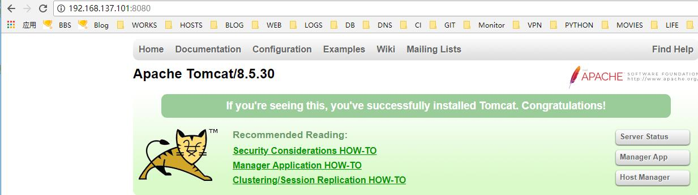
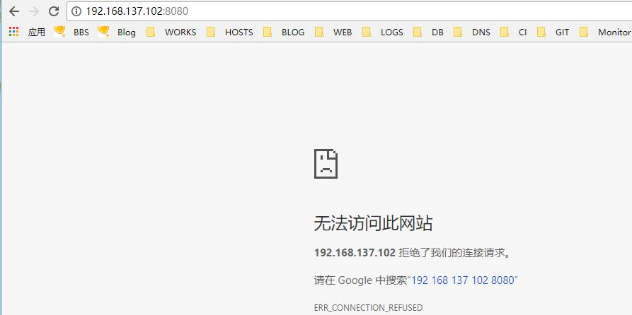
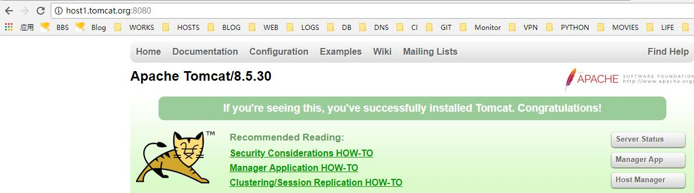
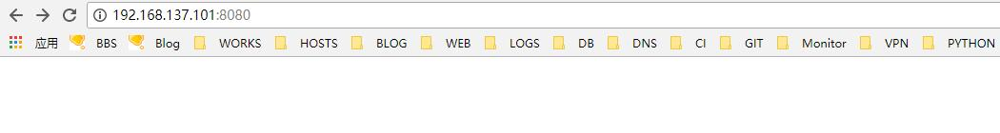
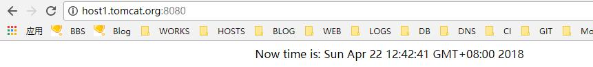
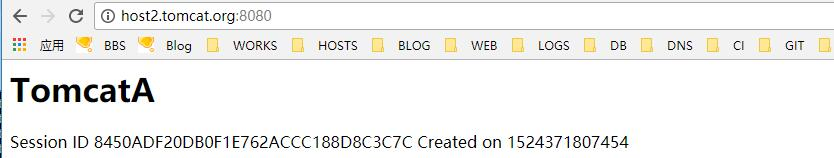

# 15.5：配置虚拟主机

**绑定IP，监听单个IP**

默认情况下，服务器上的tomcat 会监控服务器上的所有服务器。这就导致了我使用服务器上所有IP + 端口都可以访问到该tomcat 项目。为避免出现这样的情况。我们可以指定tomcat 绑定单个IP，即：tomcat 只监听某个IP 的8080 端口。

1、编辑 tomcat 主配置文件 /usr/local/tomcat/conf/server.xml ，找到配置文件文件中 &lt;Connector port="8080" protocol="HTTP/1.1" connectionTimeout="20000"  redirectPort="8443" /&gt;  段，增加 address= 参数：

```bash
    <Connector port="8080" protocol="HTTP/1.1"
               address="192.168.137.101"
               connectionTimeout="20000"
               redirectPort="8443" />
```

修改好，保存退出。重启下tomcat:

```bash
[root@centos ~]# systemctl restart tomcat
```

2、在服务器上查看监听的IP及端口：

```bash
[root@centos ~]# ss -lntp |egrep java
LISTEN     0      100     ::ffff:192.168.137.101:8080                    :::*                   users:(("java",pid=1942,fd=49))
LISTEN     0      1         ::ffff:127.0.0.1:8005                    :::*                   users:(("java",pid=1942,fd=70))
LISTEN     0      100         :::8009                    :::*                   users:(("java",pid=1942,fd=54))
```

3、测试访问，使用IP 192.168.137.101:8080 访问tomcat 项目，可以正常访问。



但是使用该服务器上的其它IP 地址访问，则无法访问：




**绑定域名**

tomcat 默认绑定的域名是localhost ，即使用该服务器上的IP 就可以访问tomcat 项目，但是有时候我们需要绑定域名，以便区分多个项目（其实这种情况基本不会出现，这里只是教大家怎么配置域名）.注：如果该配置文件中，有绑定IP 地址的话，则必须使用该IP地址做解析，然后加绑定域名方可访问：

1、编辑tomcat 主配置文件 /usr/local/tomcat/conf/server.xml ，找到配置文件文件中 &lt;Host name="localhost"  appBase="webapps"  unpackWARs="true" autoDeploy="true"&gt; 段，将 localhost 修改成要绑定的域名：

```bash
     <Host name="host1.tomcat.org"  appBase="webapps"
            unpackWARs="true" autoDeploy="true">
```

2、重启 tocmat"

```bash
[root@centos ~]# systemctl restart tomcat
```

3、做好本地解析后（注，绑定的IP 和域名）。在浏览器中使用域名，可以正常访问：



使用绑定的IP访问，无法访问：




**更换项目路径**

默认项目都在 tomcat 目录的 webapps 目录下，这里教大家怎么修改项目的默认路径，即如果项目不放在 tomcat 的 webapps 目录下该如何让 tomcat 也能识别解析

1、编辑 tomcat 主配置文件 /usr/local/tomcat/conf/server.xml ，找到配置文件文件中 &lt;Host name="localhost" appBase="webapps" unpackWARs="true" autoDeploy="true"&gt; 段，在其下面添加以下配置：

```java
<Context path="" docBase="/data/tomcat/host1" debug="0" reloadable="true" crossContext="true"/>
```

docBase : 指定项目路径

保存退出！重启tomcat 服务：

```bash
[root@centos ~]# systemctl restart tomcat
```

2、创建项目目录

```bash
[root@centos ~]# mkdir -p /data/tomcat/{host1,host2}
```

并创建测试项目文件 index.jsp:

```java
<html><body><center>
Now time is: <%=new java.util.Date()%>
</center></body></html>
```

3、浏览器测试访问（注意使用绑定的IP 地址及虚拟主机绑定的域名）：


**配置虚拟主机（在tomcat 项目这是不被建议使用的，因为只要重启tomcat,所有的项目都会被重启）**

尽管这种方式是不被大家认同的，但是还是教下大家如何配置。具体如下;

1、 编辑 tomcat 主配置文件 /usr/local/tomcat/conf/server.xml ，找到配置文件文件中 &lt;Host name="localhost" appBase="webapps" unpackWARs="true" autoDeploy="true"&gt; ......中间略  ......&lt;/Host&gt;

 段，在下面添加：

```java
            <Host name="host2.tomcat.org"  appBase="webapps"
            unpackWARs="true" autoDeploy="true">
      <Context path="" docBase="/data/tomcat/host2" debug="0" reloadable="true" crossContext="true"/>
        <Valve className="org.apache.catalina.valves.AccessLogValve" directory="logs"
               prefix="localhost_access_log" suffix=".txt"
```

完整配置：

```text
      <!--     HOST1     -->
      <Host name="host1.tomcat.org"  appBase="webapps"
            unpackWARs="true" autoDeploy="true">
      <Context path="" docBase="/data/tomcat/host1" debug="0" reloadable="true" crossContext="true"/>
        <!-- SingleSignOn valve, share authentication between web applications
             Documentation at: /docs/config/valve.html -->
        <!--
        <Valve className="org.apache.catalina.authenticator.SingleSignOn" />
        -->

        <!-- Access log processes all example.
             Documentation at: /docs/config/valve.html
             Note: The pattern used is equivalent to using pattern="common" -->
        <Valve className="org.apache.catalina.valves.AccessLogValve" directory="logs"
               prefix="localhost_access_log" suffix=".txt"
               pattern="%h %l %u %t &quot;%r&quot; %s %b" />

      </Host>
    
      <!--    HOST2    -->
      <Host name="host2.tomcat.org"  appBase="webapps"
            unpackWARs="true" autoDeploy="true">
      <Context path="" docBase="/data/tomcat/host2" debug="0" reloadable="true" crossContext="true"/>
        <Valve className="org.apache.catalina.valves.AccessLogValve" directory="logs"
               prefix="localhost_access_log" suffix=".txt"
               pattern="%h %l %u %t &quot;%r&quot; %s %b" />
      </Host>

```

2、 保存退出！重启tomcat 服务：

```bash
[root@centos ~]# systemctl restart tomcat
```

3、在虚拟主机项目2 的目录下创建测试文件 index.jsp， 内容为：

```java
<html>
<head><title>TomcatA</title></head>
  <body>
    <h1><fontcolor="red">TomcatA </font></h1>
    <tableborder="1">
      <tr>
        <td>Session ID</td>
    <%session.setAttribute("abc","abc"); %>
        <td><%= session.getId()%></td>
      </tr>
      <tr>
        <td>Created on</td>
        <td><%=session.getCreationTime() %></td>
     </tr>
    </table>
  </body>
</html>
```

4、测试访问：

host1.tomcat.org:



host2.tomcat.org



