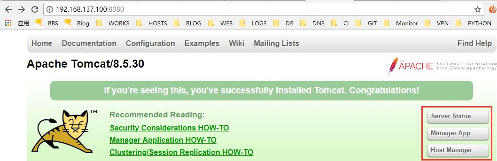
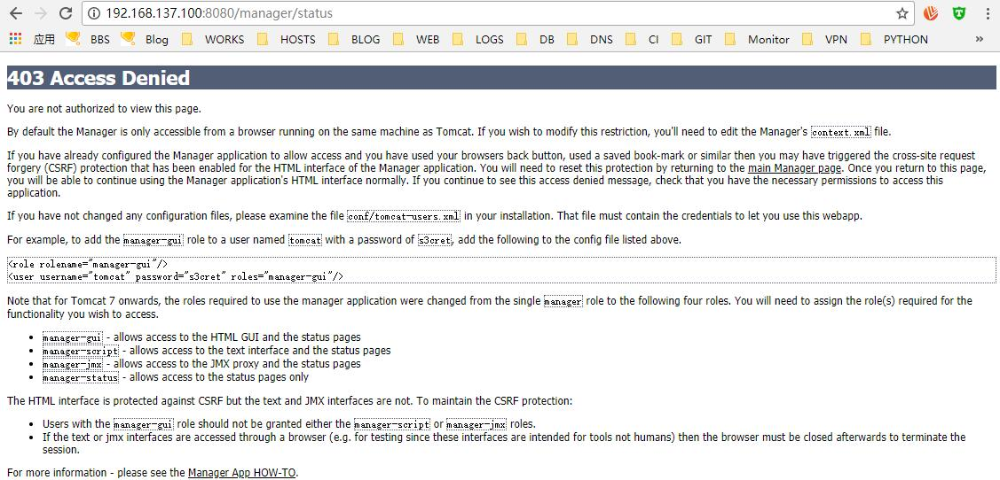

# 15.6：配置用户认证

tomcat 项目主页上有三个按钮，分别为：



点击任何一个进去提示：



那么我们先来看下官方提供的角色文档：

Manager:

```java
# Manager config document： http://HOST_IP:8080/docs/manager-howto.html
You can find the role names in the web.xml file of the Manager web application. The available roles are:

manager-gui — Access to the HTML interface.
manager-status — Access to the "Server Status" page only.
manager-script — Access to the tools-friendly plain text interface that is described in this document, and to the "Server Status" page.
manager-jmx — Access to JMX proxy interface and to the "Server Status" page.

The HTML interface is protected against CSRF (Cross-Site Request Forgery) attacks, but the text and JMX interfaces cannot be protected. It means that users who are allowed access to the text and JMX interfaces have to be cautious when accessing the Manager application with a web browser. To maintain the CSRF protection:

If you use web browser to access the Manager application using a user that has either manager-script or manager-jmx roles (for example for testing the plain text or JMX interfaces), you MUST close all windows of the browser afterwards to terminate the session. If you do not close the browser and visit other sites, you may become victim of a CSRF attack.
It is recommended to never grant the manager-script or manager-jmx roles to users that have the manager-gui role.
Note that JMX proxy interface is effectively low-level root-like administrative interface of Tomcat. One can do a lot, if he knows what commands to call. You should be cautious when enabling the manager-jmx role.
```

Host-Manager:

```java
# Host-Manager config document：http://HOST_IP:/docs/host-manager-howto.html

The Host Manager application requires a user with one of the following roles:

admin-gui - use this role for the graphical web interface.
admin-script - use this role for the scripting web interface.
```

 

然后在服务器上看下 {catalina.home}/webapps 目录下的目录结构，可以看出，host-manager 和 manager 是单独的项目，可以单独管理，对应的就是tomcat 项目首页中的 Manager APP 和 Host Mananger 两个应用。在 tomcat 7 中点击无需任何配置点击首页中的两个应用都会弹出输入用户名和密码的验证框，但是，到8 上有改变，默认给的是403 的提示。那么我们怎么去配置启用上面的功能呢？

1、看官网给出的文档提示：

 A default Tomcat installation includes the Manager. To add an instance of the Manager web application `Context` to a new host install the `manager.xml` context configuration file in the `$CATALINA_BASE/conf/[enginename]/[hostname]` folder. Here is an example:

```java
<Context privileged="true" antiResourceLocking="false"
         docBase="${catalina.home}/webapps/manager">
  <Valve className="org.apache.catalina.valves.RemoteAddrValve"
         allow="127\.0\.0\.1" />
</Context>
```

按照上面的提示，我们在 tomcat/conf/catalina/localhost 目录创建manager.xml 文件，内容为：

```java
<Context privileged="true" antiResourceLocking="false" docBase="${catalina.home}/webapps/manager">
    <Valve className="org.apache.catalina.valves.RemoteAddrValve" allow="192\.168\.137\.1" />
</Context>
```

同时，也在 tomcat/conf/catalina/localhost 目录创建 host-manager.xml 文件，内容为：

```java
<Context privileged="true" antiResourceLocking="false" docBase="${catalina.home}/webapps/host-manager">
    <Valve className="org.apache.catalina.valves.RemoteAddrValve" allow="^.*$" />
</Context>
```

创建好访问APP 并授权后，还需要编辑用户授权文件  /usr/local/tomcat/conf/tomcat-users.xml
 ，增加角色并配置好验证用户：

```text
<tomcat-users>
	<role rolename="manager-gui"/>
	<role rolename="manager-script"/>
        <role rolename="manager-status"/>
        <role rolename="manager-jmx"/>
        <role rolename="admin-gui"/>
        <role rolename="admin-script"/>
        <user username="status" password="aaa111" roles="manager-status"/>
	<user username="tomcat" password="s3cret" roles="manager-gui"/>
	<user username="admin" password="aaa111" roles="manager-gui,admin-gui,admin-script"/>
</tomcat-users>
```

重启下tomcat:

```bash
[root@centos ~]# systemctl restart tomcat
```

2、在浏览器打开 tomcat ，点击 Server Status 和 Manage App 则会要求输入密码：


点击Server Status 输入配置的密码，查看Server Status:


回到tomcat 项目，再次点击 Manager App ，则直接进入应用管理：


点击管理中 /  后面的 stop ，停止主项目 tomcat:


再次测试访问主项目：


在此点击start :


再次访问：


