# 4.2：安装Linux操作系统

**1、启动虚拟机，准备安装。在启动界面选择Install centOS 7**

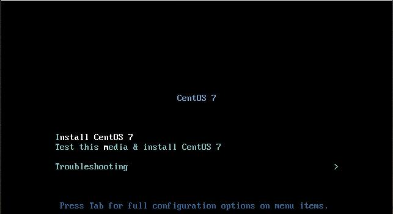

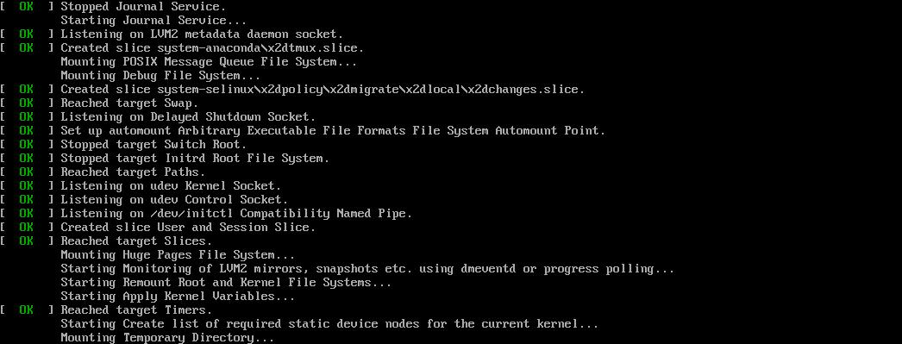

**2、安装语言选择，一般选择默认**

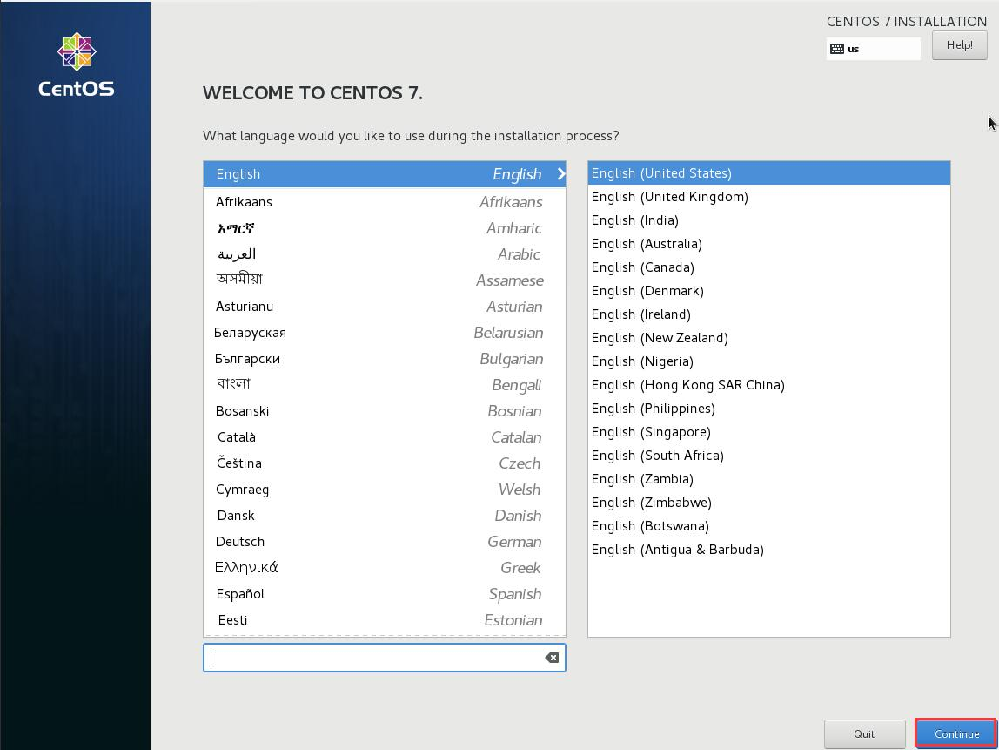

**3、安装配置**

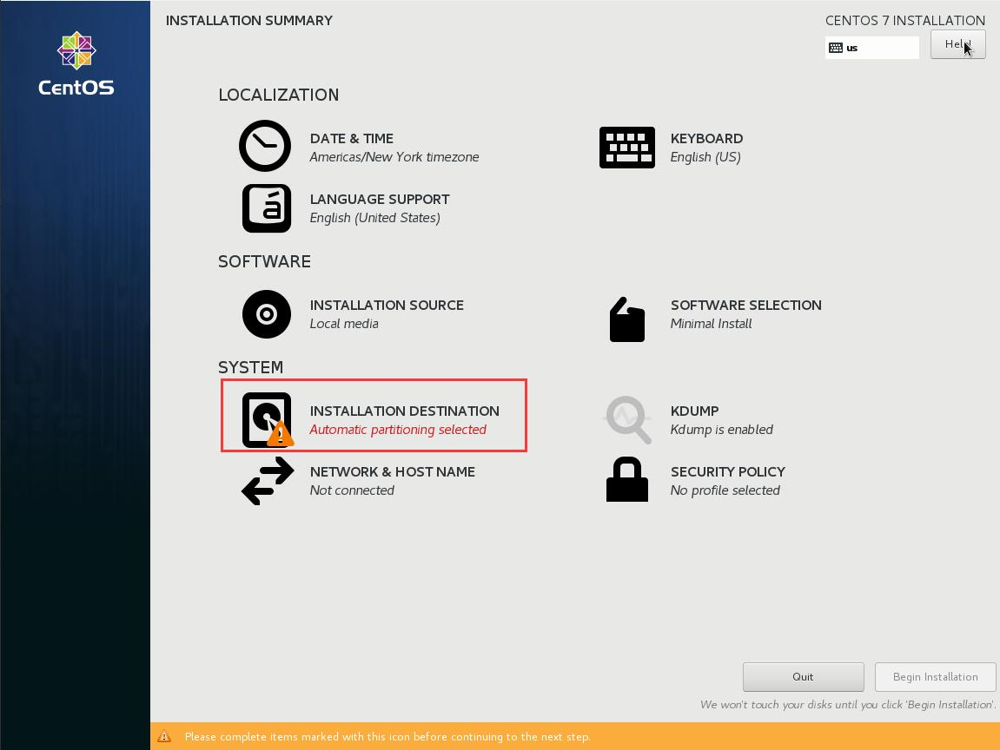

**4、选择手动分区，默认系统会自动分区**

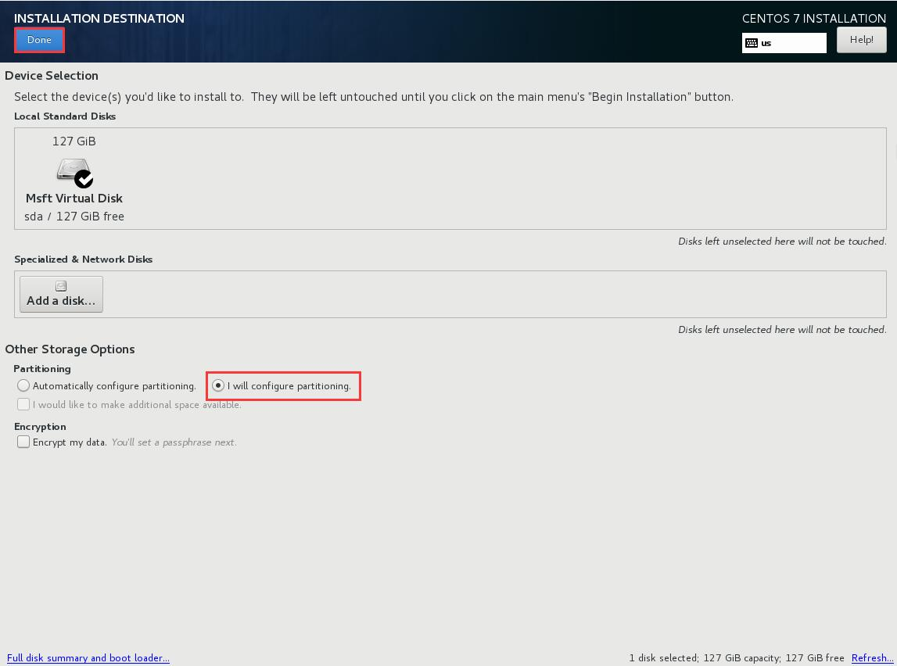

**5、一般分四个区（/boot 500MB；swap 交换分区 8GB；/home 分区 50GB；其它的都分给 / ，也就是root 分区）**

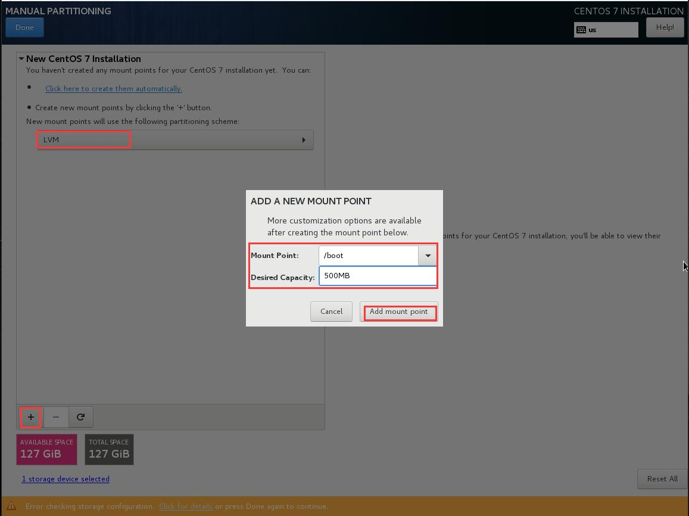

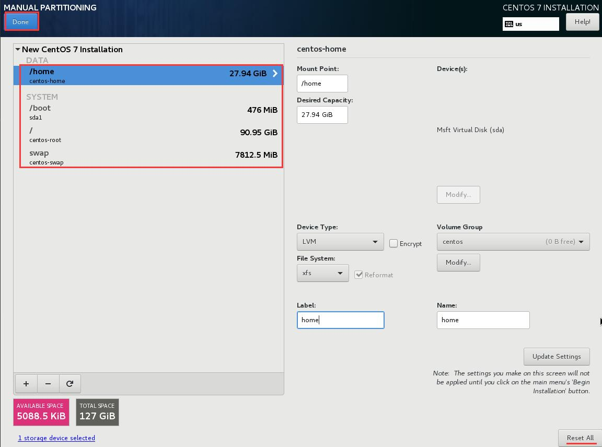

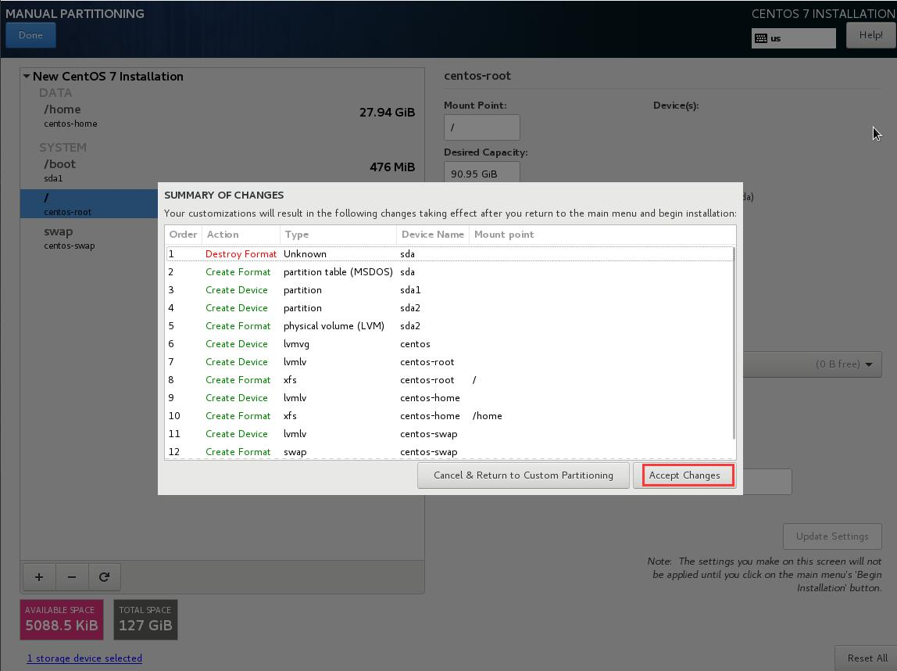

**6、分区完成后，开始执行安装**

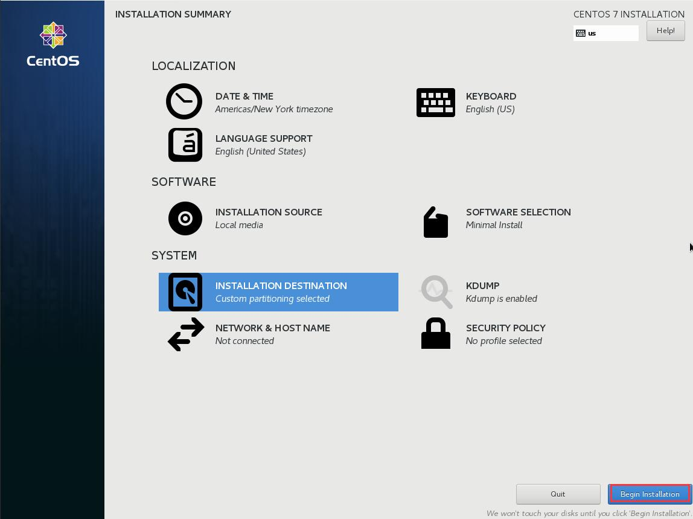

**7、设置 root 登录密码及创建普通用户（这里不创建）**

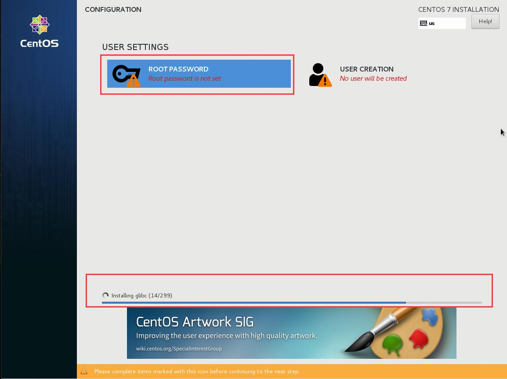

设置密码

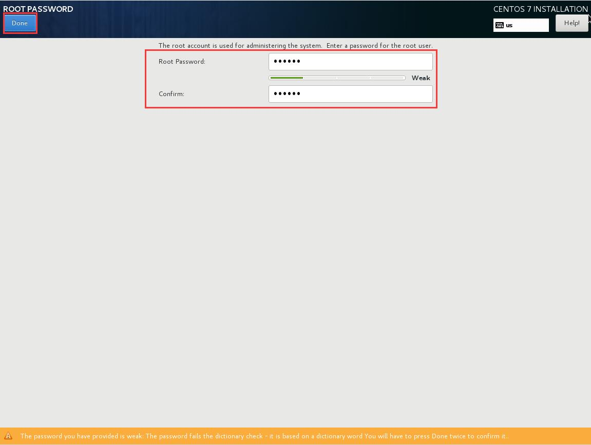

**8、安装完成，可以重启了**

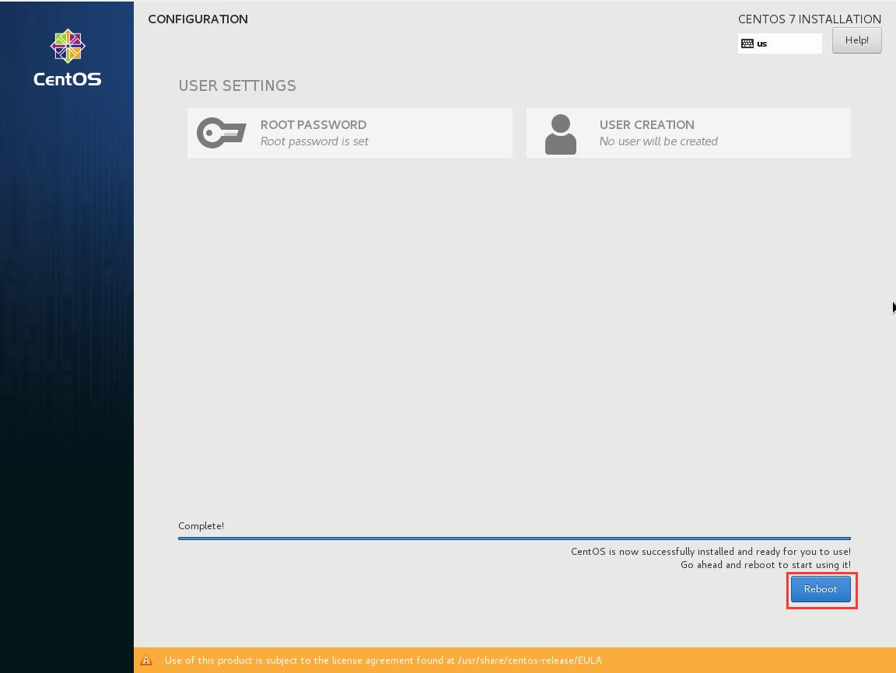

**9、重启系统，不再是安装界面，而是出现系统内核信息，直接回车进入系统：**

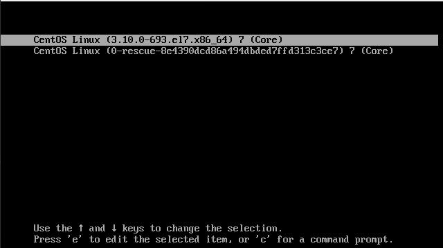

**10、以 root 身份登录系统（密码是上面自己设置的密码）：**

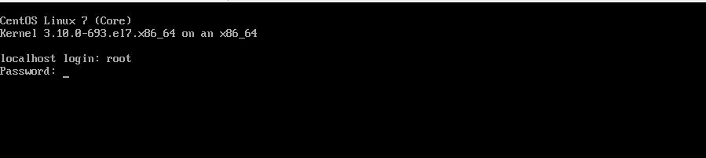

