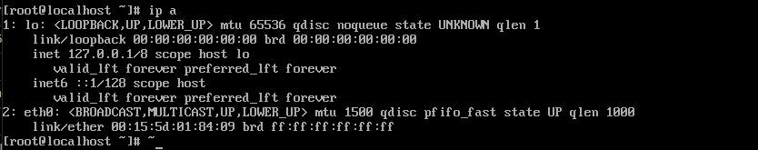

# 4.3：动态获取IP地址

登录服务器，使用命令： ip a  可以查看服务器IP 配置情况，如下：

从上图中我们可以看到，服务器除了 lo 有一个 127.0.0.1 的回环地址外，就没有其它IP地址了。也就是说，该服务器暂时只能通过本地的键盘执行  dhclient 命令获取动态IP 地址或者手动编辑配置文件，配置静态IP 地址，方可进行联网

此时，我们可以通过手动执行 dhclient 来动态获取IP 地址（命令执行，没有任何输出是正常的）：

再次使用命令 ip a  查看服务器IP 地址：

测试ping 外网：

查看配置文件 /etc/sysconfig/network-scripts/ifcfg-eth0：

