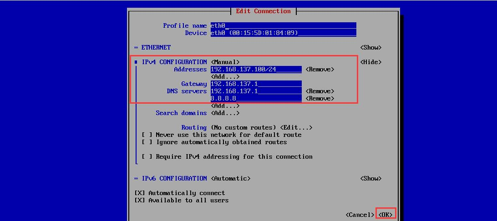

# 4.4：静态IP的配置

**GUI 模式：nmtui 命令（配置网络、服务器名称）**

登录虚拟机后，输入命令 nmtui-edit（直接打开网络配置界面）：


打开Gui 界面后，按键盘上的方向键来选中，按Enter 键确认，按DELETE 键删除：


进入配置界面后，属性名称一般不要动（系统默认识别到的），Device 是网卡MAC 地址，不要动。主要是下面的 IPv4 CONFIGURATION 部分的配置，具体如下：



配置完成后，默认会回到GUI 主界面，将光标移动到最下面的QUIT，退出配置！

退出配置后，然后在命令行，执行：

```bash
systemctl restart network
```


**命令行模式：配置文件**

使用 vi 编辑器 config/network-scripts/ifcfg-eth0：


打开配置 文件后，按键盘上的 i 键进入编辑模式（先了解），将配置文件修改成：

```bash
TYPE=Ethernet                                #网络类型，保持默认
PROXY_METHOD=none                            #
BROWSER_ONLY=no
BOOTPROTO=static                             #获取IP 的方式，dhcp 是自动获取，static 是手动配置静态IP
#BOOTPROTO=dhcp
DEFROUTE=yes                                 #使用默认路由
IPV4_FAILURE_FATAL=no
IPV6INIT=yes                                 #初始化IPV6，可以删除                                 
IPV6_AUTOCONF=yes
IPV6_DEFROUTE=yes
IPV6_FAILURE_FATAL=no
IPV6_ADDR_GEN_MODE=stable-privacy
NAME=eth0                                    #网卡名称，这里必须和 ip -a 看到的网卡名称一致
UUID=778fe642-6c83-4bdb-a4c3-77b92ebfb986    #网卡UUID
DEVICE=eth0                                  #设备名称
ONBOOT=yes                                   #启动系统是否启用
IPADDR=192.168.137.100                       #手动配置静态IP
NETMASK=255.255.255.0                        #子网掩码
GATEWAY=192.168.137.1                        #网关地址
DNS1=192.168.137.1                           #主DNS 地址
DNS2=8.8.8.8                                 #备DNS 地址
```

配置完成后，按键盘上的 ESC 键，进入 vi 的一般模式，然后按键盘上的  :wq!  四个键，回车。保存退出配置！

最后执行一下网卡重启命令（同样，不会有任何输出）：

```bash
systemctl restart network
```

此时，再次测试虚拟机能否联网：

```bash
[root@localhost ~]# ping wwww.baidu.com
PING ps_other.a.shifen.com (123.125.114.144) 56(84) bytes of data.
64 bytes from 123.125.114.144 (123.125.114.144): icmp_seq=1 ttl=47 time=77.2 ms
64 bytes from 123.125.114.144 (123.125.114.144): icmp_seq=2 ttl=47 time=76.1 ms
64 bytes from 123.125.114.144 (123.125.114.144): icmp_seq=3 ttl=47 time=76.3 ms
64 bytes from 123.125.114.144 (123.125.114.144): icmp_seq=4 ttl=47 time=76.3 ms

```


**扩展：只有一张网卡，如何配置多个IP地址呢？如下：**

编辑网卡配置文件，在配置文件中新增要增加的IP地址。需要注意的是： 除了第一个IP地址需要网关外，其它新增的都不能加网关地址。

```bash
[root@node100 ~]# cat /etc/sysconfig/network-scripts/ifcfg-eth0
TYPE=Ethernet
PROXY_METHOD=none
BROWSER_ONLY=no
BOOTPROTO=static
#BOOTPROTO=dhcp
DEFROUTE=yes
IPV4_FAILURE_FATAL=no
IPV6INIT=yes
IPV6_AUTOCONF=yes
IPV6_DEFROUTE=yes
IPV6_FAILURE_FATAL=no
IPV6_ADDR_GEN_MODE=stable-privacy
NAME=eth0
UUID=778fe642-6c83-4bdb-a4c3-77b92ebfb986
DEVICE=eth0
ONBOOT=yes
IPADDR=192.168.137.100                    #第一个IP地址
PREFIX=24                                 #第一个IP子网掩码
IPADDR1=192.168.137.101                   #第二个IP地址(注意有标识)
PREFIX1=24                                #第二个IP子网掩码
IPADDR2=192.168.137.102                   #第三个IP地址注意有标识)
PREFIX2=24                                #第三个IP子网掩码
GATEWAY=192.168.137.1                     #第一个IP地址的网关
DNS1=192.168.137.1                        #主 DNS
DNS2=8.8.8.8                              #备 DNS
```

然后执行网卡重启命令：

```text
systemctl restart network
```

使用nmcli 命令查看或者使用 ip a 命令查看：

```bash
[root@node100 ~]# nmcli
eth0: connected to eth0
        "eth0"
        ethernet (hv_netvsc), 00:15:5D:01:84:09, hw, mtu 1500
        ip4 default
        inet4 192.168.137.100/24
        inet4 192.168.137.101/24
        inet4 192.168.137.102/24
        inet6 fe80::9b91:22cc:e449:f255/64

lo: unmanaged
        "lo"
        loopback (unknown), 00:00:00:00:00:00, sw, mtu 65536

DNS configuration:
        servers: 192.168.137.1 8.8.8.8
        interface: eth0

Use "nmcli device show" to get complete information about known devices and
"nmcli connection show" to get an overview on active connection profiles.

Consult nmcli(1) and nmcli-examples(5) manual pages for complete usage details.
```

确保每个IP 地址都是可以正常通讯的：

```text
C:\Users\vnlinuser>ping 192.168.137.100

正在 Ping 192.168.137.100 具有 32 字节的数据:
来自 192.168.137.100 的回复: 字节=32 时间<1ms TTL=64
来自 192.168.137.100 的回复: 字节=32 时间<1ms TTL=64
来自 192.168.137.100 的回复: 字节=32 时间<1ms TTL=64
来自 192.168.137.100 的回复: 字节=32 时间<1ms TTL=64

192.168.137.100 的 Ping 统计信息:
    数据包: 已发送 = 4，已接收 = 4，丢失 = 0 (0% 丢失)，
往返行程的估计时间(以毫秒为单位):
    最短 = 0ms，最长 = 0ms，平均 = 0ms

C:\Users\vnlinuser>ping 192.168.137.101

正在 Ping 192.168.137.101 具有 32 字节的数据:
来自 192.168.137.101 的回复: 字节=32 时间<1ms TTL=64
来自 192.168.137.101 的回复: 字节=32 时间<1ms TTL=64
来自 192.168.137.101 的回复: 字节=32 时间<1ms TTL=64
来自 192.168.137.101 的回复: 字节=32 时间<1ms TTL=64

192.168.137.101 的 Ping 统计信息:
    数据包: 已发送 = 4，已接收 = 4，丢失 = 0 (0% 丢失)，
往返行程的估计时间(以毫秒为单位):
    最短 = 0ms，最长 = 0ms，平均 = 0ms

C:\Users\vnlinuser>ping 192.168.137.102

正在 Ping 192.168.137.102 具有 32 字节的数据:
来自 192.168.137.102 的回复: 字节=32 时间<1ms TTL=64
来自 192.168.137.102 的回复: 字节=32 时间<1ms TTL=64
来自 192.168.137.102 的回复: 字节=32 时间<1ms TTL=64
来自 192.168.137.102 的回复: 字节=32 时间<1ms TTL=64

192.168.137.102 的 Ping 统计信息:
    数据包: 已发送 = 4，已接收 = 4，丢失 = 0 (0% 丢失)，
往返行程的估计时间(以毫秒为单位):
    最短 = 0ms，最长 = 0ms，平均 = 0ms
```

