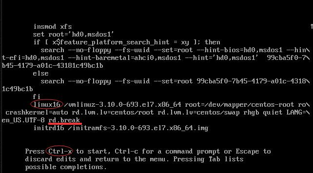
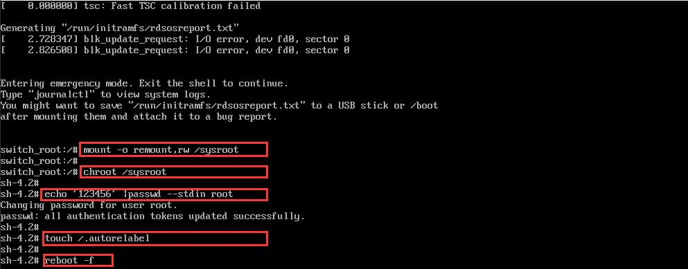
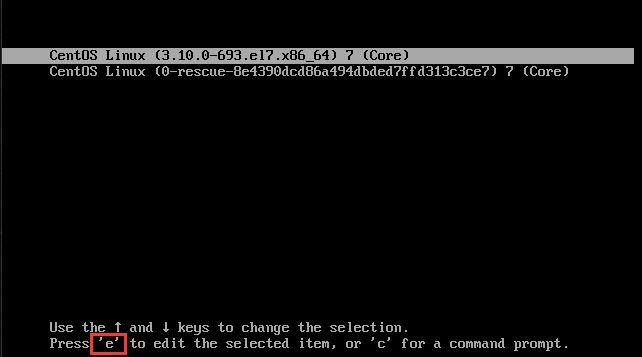
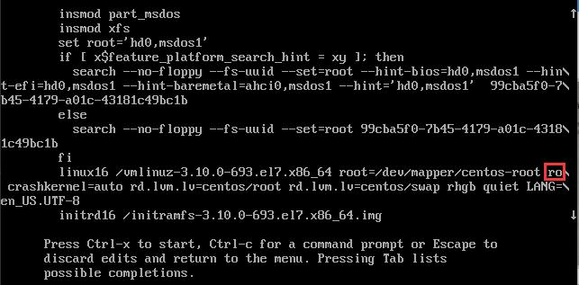
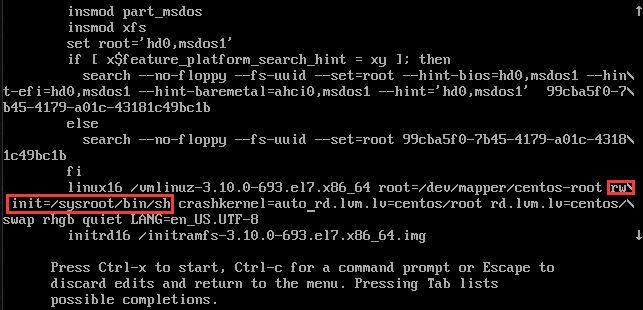
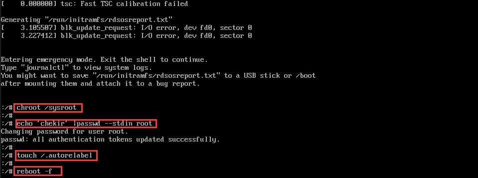
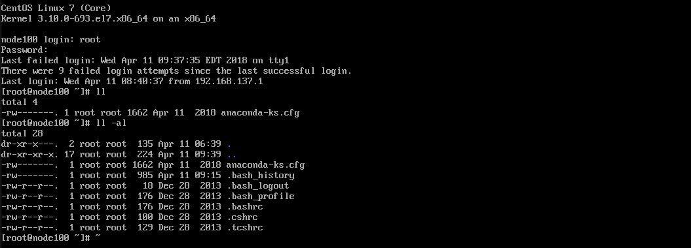

# 4.6：单用户修改root 密码

**方式一： rd.break**

重启服务器，在显示内核信息的时候，按键盘上的方向键，暂停倒计时自动进入系统。选中带有系统内核的那一行，然后按键盘上的 e 键：


找到带有关键字 linux16 的这一行（注：是第一次出现这个关键字的那一行），将光标移动到该行的最末尾，按下空格键，然后接着输入 rd.break 。接着，同时按键盘的 ctrl + x 键，进入单用户模式：



进入单用户模式后，在命令提示符后面输入：

```text
mount -o remount,rw /sysroot   # 重新挂在系统根目录
chroot /sysroot                # 修改根目录属性
echo ‘NEW-ROOT-PASSWORD’ |passwd --stdin root    # 重新修改 root 密码
touch /.autorelabel           # 创建认证标签隐藏文件
reboot -f                      # 最后强制重启系统
```



**方式二：ro 修改为 rw init=/sysroot/bin/sh**

重启服务器，在显示内核信息的时候，按键盘上的方向键，暂停倒计时自动进入系统。选中带有系统内核的那一行，然后按键盘上的 e 键：



找到inux16 的这一行（注：是第一次出现这个关键字的那一行），将光标移动到 ro 位置，将其删除，然后输入 rw init=/sysroot/bin/sh 。接着，同时按键盘的 ctrl + x 键，进入单用户模式：





进入命令行模式，输入如下命令：

```text
chroot /sysroot
echo 'chekir' |passwd --stdin root
touch /.autorelabel
reboot -f
```



**注：**这种模式修改密码后，第一次重启是无法正常进入系统的。会卡在初始化界面一会，过几秒会再次重启，然后可以正常进入系统。


第二次重启后，以新密码登录系统：



**参考网站：**[**https://www.linuxtechi.com/boot-rhel-7-centos-7-server-single-user-mode/**](https://www.linuxtechi.com/boot-rhel-7-centos-7-server-single-user-mode/)

