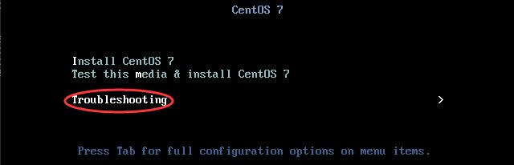
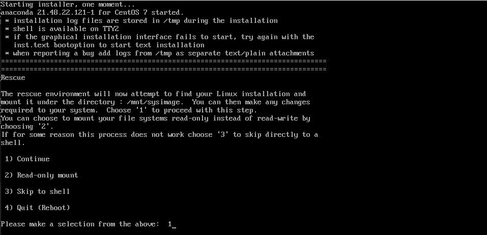
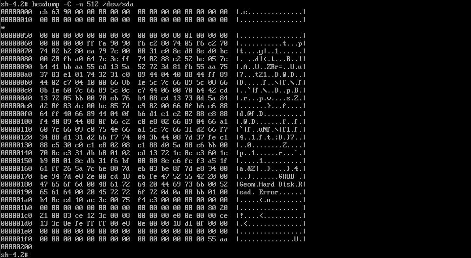
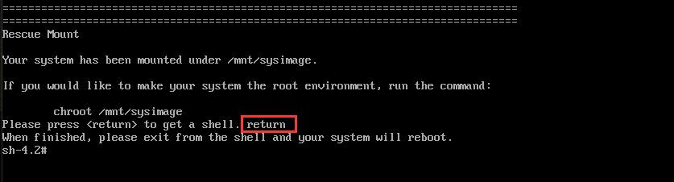

# 4.8：救援模式

**一、分区表救援：**

首先，我们来看下正常的分区表情况（只需看前面 512 个字节）：

```bash
[root@centos ~]# hexdump -C -n 512 /dev/sda
00000000  eb 63 90 00 00 00 00 00  00 00 00 00 00 00 00 00  |.c..............|
00000010  00 00 00 00 00 00 00 00  00 00 00 00 00 00 00 00  |................|
*
00000050  00 00 00 00 00 00 00 00  00 00 00 80 01 00 00 00  |................|
00000060  00 00 00 00 ff fa 90 90  f6 c2 80 74 05 f6 c2 70  |...........t...p|
00000070  74 02 b2 80 ea 79 7c 00  00 31 c0 8e d8 8e d0 bc  |t....y|..1......|
00000080  00 20 fb a0 64 7c 3c ff  74 02 88 c2 52 be 05 7c  |. ..d|<.t...R..||
00000090  b4 41 bb aa 55 cd 13 5a  52 72 3d 81 fb 55 aa 75  |.A..U..ZRr=..U.u|
000000a0  37 83 e1 01 74 32 31 c0  89 44 04 40 88 44 ff 89  |7...t21..D.@.D..|
000000b0  44 02 c7 04 10 00 66 8b  1e 5c 7c 66 89 5c 08 66  |D.....f..\|f.\.f|
000000c0  8b 1e 60 7c 66 89 5c 0c  c7 44 06 00 70 b4 42 cd  |..`|f.\..D..p.B.|
000000d0  13 72 05 bb 00 70 eb 76  b4 08 cd 13 73 0d 5a 84  |.r...p.v....s.Z.|
000000e0  d2 0f 83 de 00 be 85 7d  e9 82 00 66 0f b6 c6 88  |.......}...f....|
000000f0  64 ff 40 66 89 44 04 0f  b6 d1 c1 e2 02 88 e8 88  |d.@f.D..........|
00000100  f4 40 89 44 08 0f b6 c2  c0 e8 02 66 89 04 66 a1  |.@.D.......f..f.|
00000110  60 7c 66 09 c0 75 4e 66  a1 5c 7c 66 31 d2 66 f7  |`|f..uNf.\|f1.f.|
00000120  34 88 d1 31 d2 66 f7 74  04 3b 44 08 7d 37 fe c1  |4..1.f.t.;D.}7..|
00000130  88 c5 30 c0 c1 e8 02 08  c1 88 d0 5a 88 c6 bb 00  |..0........Z....|
00000140  70 8e c3 31 db b8 01 02  cd 13 72 1e 8c c3 60 1e  |p..1......r...`.|
00000150  b9 00 01 8e db 31 f6 bf  00 80 8e c6 fc f3 a5 1f  |.....1..........|
00000160  61 ff 26 5a 7c be 80 7d  eb 03 be 8f 7d e8 34 00  |a.&Z|..}....}.4.|
00000170  be 94 7d e8 2e 00 cd 18  eb fe 47 52 55 42 20 00  |..}.......GRUB .|
00000180  47 65 6f 6d 00 48 61 72  64 20 44 69 73 6b 00 52  |Geom.Hard Disk.R|
00000190  65 61 64 00 20 45 72 72  6f 72 0d 0a 00 bb 01 00  |ead. Error......|
000001a0  b4 0e cd 10 ac 3c 00 75  f4 c3 00 00 00 00 00 00  |.....<.u........|
000001b0  00 00 00 00 00 00 00 00  00 00 00 00 00 00 80 20  |............... |
000001c0  21 00 83 ce 12 3c 00 08  00 00 00 e0 0e 00 00 ce  |!....<..........|
000001d0  13 3c 8e fe ff ff 00 e8  0e 00 00 18 d1 0f 00 00  |.<..............|
000001e0  00 00 00 00 00 00 00 00  00 00 00 00 00 00 00 00  |................|
000001f0  00 00 00 00 00 00 00 00  00 00 00 00 00 00 55 aa  |..............U.|
00000200
```

手动故意 破坏下分区表：

```bash
[root@centos ~]# dd if=/dev/zero of=/dev/sda bs=1 count=446
446+0 records in
446+0 records out
446 bytes (446 B) copied, 0.000308301 s, 1.4 MB/s
```

再次查看分区表：

```bash
[root@centos ~]#  hexdump -C -n 512 /dev/sda
00000000  00 00 00 00 00 00 00 00  00 00 00 00 00 00 00 00  |................|
*
000001b0  00 00 00 00 00 00 00 00  00 00 00 00 00 00 80 20  |............... |
000001c0  21 00 83 ce 12 3c 00 08  00 00 00 e0 0e 00 00 ce  |!....<..........|
000001d0  13 3c 8e fe ff ff 00 e8  0e 00 00 18 d1 0f 00 00  |.<..............|
000001e0  00 00 00 00 00 00 00 00  00 00 00 00 00 00 00 00  |................|
000001f0  00 00 00 00 00 00 00 00  00 00 00 00 00 00 55 aa  |..............U.|
00000200
```

接着，重启服务器，发现可以正常引导，但是无法进入到系统：


 插入安装光盘，重新启动服务器， 进入救援模式：




按照提示，输入数字 1 继续：



按提示输入return 进入 shell 命令行模式：


进入命令行模式后，输入修复命令：

```bash
grub2-install --directory=/mnt/sysimage/usr/lib/grub/i386-pc/ --root-directory=/mnt/sysimage /dev/sda
```


安装成功，无报错！再次查看分区表：



退出安装光盘。重新启动系统，可以发现可以正常进入系统了：


**二、grub 救援：**

首先，查看下 /boot/grub2 目录下有哪些文件：

```bash
[root@centos ~]# ls /boot/grub2
device.map  fonts  grub.cfg  grubenv  i386-pc  locale  user.cfg
```

手动删除grub2 目录：

```bash
[root@centos ~]# rm -rf /boot/grub2
```

重启服务器，发现可以正常引导，但是无法正常进入系统：


插入安装光盘，重启服务器。进入救援模式：


 按照提示，输入数字 1 继续：


 按提示输入return 进入 shell 命令行模式：



执行命令，输入：

```bash
chroot /mnt/sysimage
```


执行grub 安装命令，输入：

```bash
grub2-install /dev/sda
```


安装完成，未报错。查看/boot 目录下是否有了 grub2目录：


执行grub 配置文件生成命令，输入：

```bash
grub2-mkconfig -o /boot/grub2/grub.cfg
```


生成成功，检查 /boot/grub2 目录下是否有 grub.cfg 文件：


最后，退出安装光盘，重启服务器。正常引导进入系统：


